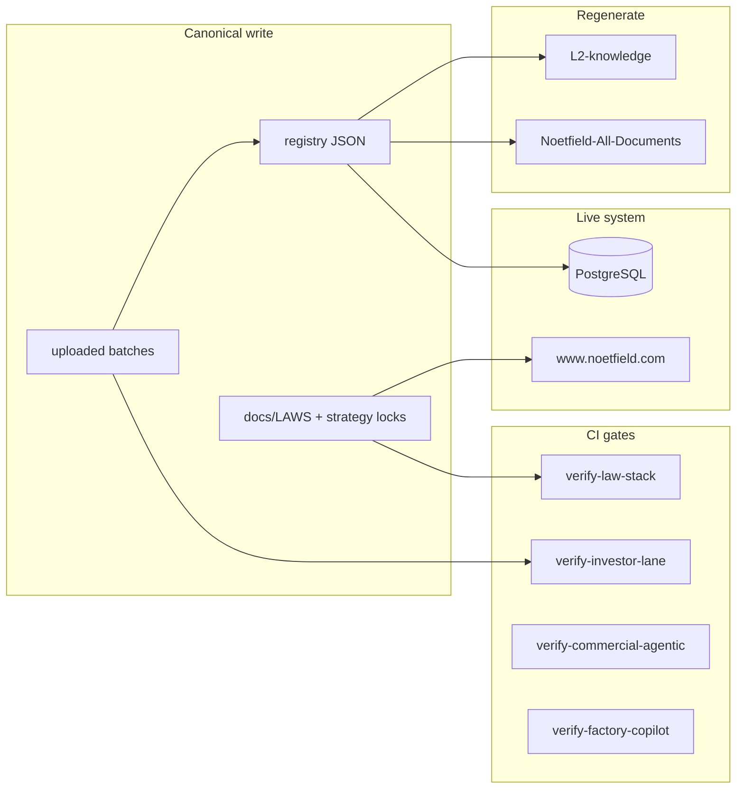

# Pipelines — verify, ingest, sync, deploy

**Version:** 2026.06.03 · Run from repo root.

---

## Daily developer loop

```bash
make bootstrap          # once: venv + npm
make validate           # compileall + git diff --check
make verify-law-stack   # anti-drift law + registry
```

---

## Law & copy gates

| Target | Script / test | What it guards |
|--------|---------------|----------------|
| `make verify-law-stack` | `scripts/verify-law-stack.sh` + pytest | Current law visible, registry L0 = GCIP v4, mirror sync |
| `make verify-investor-lane` | `verify-investor-diligence-lane.sh` | Investor diligence docs + www |
| `make verify-commercial-agentic` | `verify-commercial-agentic.sh` | Demo/trial + commercial reference |
| `make verify-factory-copilot` | `verify-factory-copilot.sh` + pytest | AI factory YAML spec + 8-node pipeline |
| `make verify-final-lock` | audit + GTM pytest | Payment language prohibition |

---

## Source-of-truth ingest (live registry)

```bash
make apply-migrations   # PostgreSQL schema
make ingest-sot-dry-run # preview
make ingest-sot         # load registry → DB
```

**Canonical JSON only:** `docs/SOURCE_OF_TRUTH/registry/`

---

## Anti-fragmentation sync (derived trees)

```bash
make sync-derived-docs
```

Runs:

1. `scripts/build_desktop_document_bundle.py` → `Noetfield-All-Documents/`
2. `scripts/sync_l2_knowledge.py` → `L2-knowledge/strategy/`

**Never edit derived copies** — edit canonical upload + registry, then sync.

---

## Runtime verification

```bash
make phase33-verify              # unit tests (memory)
make phase33-postgres-verify     # integration + postgres
make phase35-demo                # copilot governance demo package
make verify-factory-copilot      # AI factory spec + runtime smoke
```

### AI factory (Copilot Governance Readiness)

```bash
make verify-factory-copilot
# HTTP: POST /factories/copilot_governance_readiness_v1/run
# Legacy: POST /use-cases/copilot-governance/demo
```

Spec: `packages/schemas/factories/copilot_governance_readiness_v1.yaml`

---

## Public semantic lock

```bash
make final-lock-semantic   # replace forbidden terms in public HTML
make final-lock-audit      # scan → PRODUCTION_READINESS_REPORT.md
```

---

## Pipeline diagram



---

## Memory & skills (agent orientation)

| Need | Read |
|------|------|
| What law applies now? | `docs/LAWS/CURRENT_STACK_v2026.md` |
| What can we sell? | `OFFERINGS.md` |
| Where is doc X? | `docs/SOURCE_OF_TRUTH/registry/source_document_inventory.json` |
| Old version of Y? | `docs/SOURCE_OF_TRUTH/archive/SUPERSESSION_INDEX.md` |
| Commercial UI patterns? | `docs/strategy/COMMERCIAL_AGENTIC_UI_REFERENCE_v1.md` |
| AI factory spec? | `packages/schemas/factories/copilot_governance_readiness_v1.yaml` |

Machine manifest: `governance/LAW_STACK.json`
