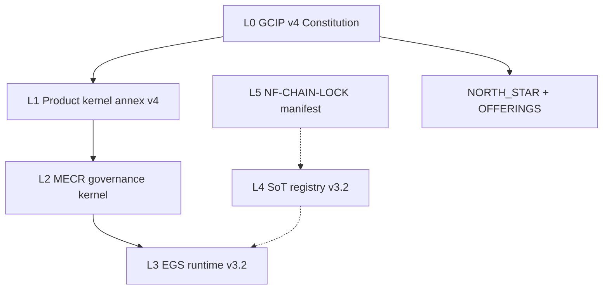

# Noetfield law stack — current (visible)

**Version:** `2026.06.03` · **Registry:** `source_of_truth_registry.json` · **Anti-drift:** run `make verify-law-stack`

This folder is the **single human entry point** for “what law applies now.” Old versions remain in batch folders under `docs/SOURCE_OF_TRUTH/uploaded/` — indexed in [`../SOURCE_OF_TRUTH/archive/SUPERSESSION_INDEX.md`](../SOURCE_OF_TRUTH/archive/SUPERSESSION_INDEX.md).

---

## Read this first

| Priority | Document | Role |
|----------|----------|------|
| **1** | [CURRENT_STACK_v2026.md](./CURRENT_STACK_v2026.md) | Full L0–L5 + GTM locks — **latest visible stack** |
| **2** | [`../../NORTH_STAR.md`](../../NORTH_STAR.md) | Public engineering + GTM constitution |
| **3** | [`../../OFFERINGS.md`](../../OFFERINGS.md) | Three contract SKUs (FINAL LOCK) |
| **4** | [`../../PLATFORM_BLUEPRINT.md`](../../PLATFORM_BLUEPRINT.md) | Architecture constitution |
| **5** | [`../../DEPLOYMENT_ARCHITECTURE.md`](../../DEPLOYMENT_ARCHITECTURE.md) | Domain split (www vs platform) |
| **6** | [`../platform/CATALOG.md`](../platform/CATALOG.md) | Tier + factory dual registry (platform) |

Machine-readable manifest: [`../../governance/LAW_STACK.json`](../../governance/LAW_STACK.json)

---

## Layer map (L0 → L5)

**Supremacy:** GCIP v4 overrides all documents, code comments, marketing, and partner decks on conflict.

---

## Operational locks (verified in CI)

| Lane | Path | Verify |
|------|------|--------|
| Investor governance | `docs/strategy/INVESTOR_GOVERNANCE_LANE_LOCKED_v1.md` | `make verify-investor-lane` |
| Commercial agentic UI | `docs/strategy/COMMERCIAL_AGENTIC_UI_REFERENCE_v1.md` | `make verify-commercial-agentic` |
| Buyer www copy | tier HTML pages | `scripts/verify-www-buyer-audience.sh` |

---

## Canonical vs derived (anti-fragmentation)

| Write here | Never edit as source |
|------------|---------------------|
| `docs/SOURCE_OF_TRUTH/uploaded/` | `L2-knowledge/` |
| `docs/SOURCE_OF_TRUTH/registry/*.json` | `Noetfield-All-Documents/registry/` |
| `docs/strategy/*_LOCKED_*.md` | Desktop mirrors |

**Regenerate derived trees:** `make sync-derived-docs`

---

## Routing & pipelines

- [ROUTING.md](./ROUTING.md) — www, platform, repo paths
- [PIPELINES.md](./PIPELINES.md) — verify, ingest, deploy, sync

---

## Old versions

Do not cite batch documents marked **superseded** in the supersession index. Use **CURRENT** paths only for implementation and public copy.
