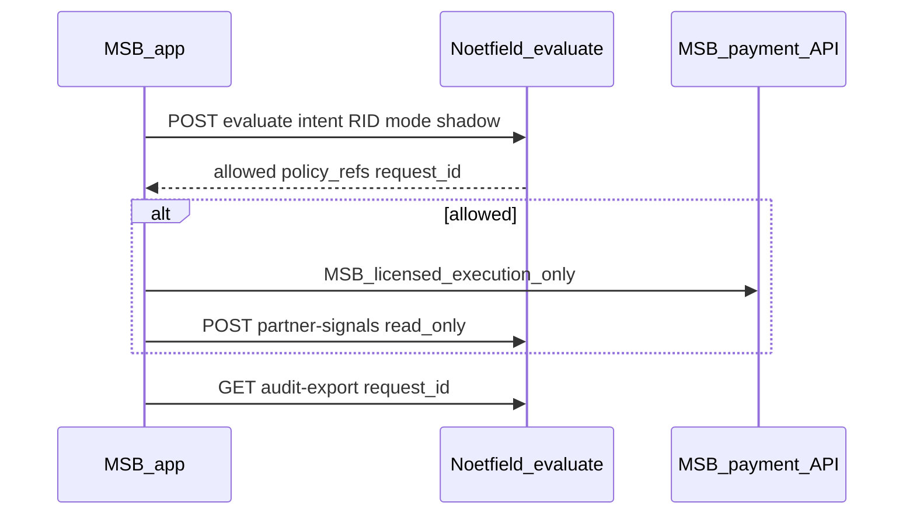

# MSB staging integration guide

**For:** Licensed MSB / PSP engineering teams (design partner).  
**Mode:** `shadow` only until Noetfield and MSB legal sign an enforce addendum.

## Architecture



## Step 1 — Credentials

Noetfield issues per-tenant pilot key (`tenant_uuid:secret`). Store in MSB secrets manager — not in client-side mobile apps.

## Step 2 — Evaluate before payment intent

```bash
curl -sS -X POST "$PLATFORM/api/v1/governance/evaluate" \
  -H "Authorization: Bearer $PILOT_API_KEY" \
  -H "Content-Type: application/json" \
  -d @- <<EOF
{
  "tenant_id": "YOUR_TENANT_UUID",
  "organization_id": "YOUR_ORG_UUID",
  "action": "initiate_transfer_intent",
  "resource_type": "msb_payment",
  "resource_id": "staging-transfer-001",
  "mode": "shadow",
  "request_id": "RID-MSB-STAGING-001",
  "correlation_id": "msb-run-001",
  "payload": { "currency": "CAD", "program": "remittance" }
}
EOF
```

Preset JSON: `GET /api/v1/governance/scenario-presets/msb`

## Step 3 — Read-only signals (optional)

After execution on **your** rails only:

```bash
curl -sS -X POST "$PLATFORM/api/v1/governance/partner-signals" \
  -H "Authorization: Bearer $PILOT_API_KEY" \
  -H "Content-Type: application/json" \
  -d '{
    "tenant_id": "YOUR_TENANT_UUID",
    "organization_id": "YOUR_ORG_UUID",
    "partner_id": "msb-staging",
    "signal_kind": "transfer_status",
    "request_id": "RID-MSB-STAGING-001",
    "payload": { "status": "completed", "read_only": true }
  }'
```

**Rejected:** payloads containing `place_order`, `withdraw`, `payment_intent`, etc.

## Step 4 — Trust Ledger export

```bash
curl -sS "$PLATFORM/api/v1/governance/audit-export?request_id=RID-MSB-STAGING-001" \
  -H "Authorization: Bearer $PILOT_API_KEY"
```

## Step 5 — Webhooks (production pilot)

Set `GOVERNANCE_WEBHOOK_URLS` on Noetfield side to MSB SIEM/GRC endpoint. Event: `governance.decision.recorded`.

## Annual license path

After 30-day shadow success:

1. Shadow Pack SOW complete (see `ops/private/msb/`)
2. API License Schedule — flat or metered evaluate calls
3. `enforce` mode only with signed addendum

## SDK

`packages/sdk` — `NoetfieldClient.evaluate()`, `audit_export()`, `get_ledger()`.

## Support

operations@noetfield.com — include RID in subject line.
