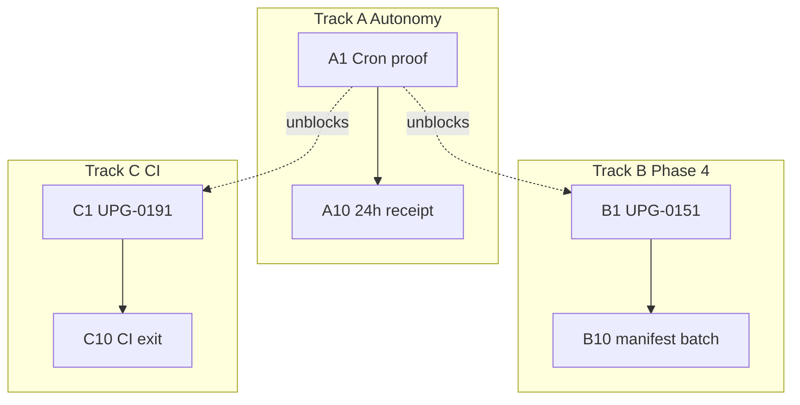

# [NOOS-AGENT-20260702-025] Three-Track 10-Step Upgrade Plan v1

<!--
NOOS-AGENT-DOC
agent_id: noetfeld-os-cursor-chat
agent_lane: NOETFELD-OS
trace_id: NOOS-AGENT-20260702-025
doc_type: UPGRADE_PLAN_10_STEP
workspace_root: /Users/sinakazemnezhad/Projects/noetfeld-os
classification: INTERNAL — sprint-grade upgrade tracks
authority: UPGRADE_MANIFEST.json, NOOS-AGENT-20260615-014
related_docs: NOOS-AGENT-20260615-014, NOOS-AGENT-20260702-024
manifest: docs/_NOOS_AGENT/MANIFEST.json
-->

**Status:** Active · 2026-07-02  
**Scope:** Three parallel 10-step tracks — Factory Autonomy (A), Phase 4 Chain Tools (B), CI/Quality (C)  
**Baseline:** Migration `0012` applied · dashboard v1.1 · canary `e2e0b8b` · schedule silence diagnosed

---

## Execution rule

**Track A is P0** and unblocks B/C cloud inbox drain. Tracks B and C run in parallel once A1–A3 are green.

---

## Track A — Factory Autonomy (10 steps)

**Win condition:** ≥2 consecutive `schedule` runs · factory Supabase row FRESH · zero `workflow_dispatch` · `founder_blocked` in every cycle receipt.

| Step | ID | Priority | Action | Success check |
|------|-----|----------|--------|---------------|
| 1 | A1 | P0 | Poll GitHub API for first `event=schedule` run | Run ID + success |
| 2 | A2 | P0 | Confirm scheduled workflows enabled on private repo | Enable API 204 |
| 3 | A3 | P0 | External bridge: CF cron → `repository_dispatch` | No Cursor manual |
| 4 | A4 | P0 | Persist `cloud_trigger` + `cloud_meta` in factory sink | Supabase row |
| 5 | A5 | P0 | `make autorun-status` → `noos_factory_autorun` FRESH | age < 30m |
| 6 | A6 | P0 | Worker `founder_blocked` every cycle | NOOS-C-01 blocked |
| 7 | A7 | P1 | Empty queue → `IDLE_NO_WORK` + `idle_reason` | Cycle receipt |
| 8 | A8 | P1 | Dashboard v1.2 — factory + schedule run age | Read-only |
| 9 | A9 | P1 | Dashboard inbox freshness from inbox timestamps | founder count |
| 10 | A10 | P1 | 24h zero-manual proof receipt | schedule-only |

**Key files:** `.github/workflows/noos-factory-autorun.yml`, `scripts/run_noetfield_factory_loop_v1.py`, `scripts/cloud_inbox_worker_v1.py`

---

## Track B — Phase 4 Chain Tools (10 steps)

**Win condition:** Inbox UPG drained (except `founder_blocked`) · UPG-0151–0158 in manifest · real CLI handlers.

| Step | UPG | Action |
|------|-----|--------|
| B1 | 0151 | PyPI metadata / pyproject verify |
| B2 | 0152 | `noetfield gate --json` |
| B3 | 0153 | `noetfield gate --strict` |
| B4 | 0156 | `noetfield decide --file` schema validation |
| B5 | 0158 | `noetfield verify` subcommand |
| B6 | 0157 | Receipt writes `~/.noetfield/receipts/` |
| B7 | 0154 | Gate G6 pytest check |
| B8 | 0155 | Gate PRODUCT_TRUTH alignment |
| B9 | 0159 | Integration test gate PASS |
| B10 | — | Manifest batch close |

**Depends on:** Track A A1–A3.

---

## Track C — CI & Quality (10 steps)

**Win condition:** `main` protected by pytest + gate + agent-doc checks.

| Step | UPG | Action |
|------|-----|--------|
| C1 | 0191 | pytest on push |
| C2 | 0191 | Cloud worker handler wired |
| C3 | 0192 | `check_noos_agent_docs.sh` in CI |
| C4 | 0194 | `noetfield gate` required |
| C5 | 0193 | business strategy check |
| C6 | 0195 | Dependabot |
| C7 | 0197 | gitleaks |
| C8 | 0196 | SBOM |
| C9 | — | CI separate from factory autorun |
| C10 | — | CI exit + manifest |

---

## Track D — SourceA Supabase observe (optional)

10-step read-only lane for `truth_log` / `cycle_receipts` dashboard probes. Defer until A/B/C P0 complete.

---

## Scope boundaries

| In scope | Out of scope |
|----------|--------------|
| NOOS factory, inbox, gate, CI | TrustField / SourceA product edits |
| Supabase + GitHub Actions | `phase_reconciler_v1` replacement |
| Read-only dashboard | NW1/SW1 sends |

---

## Start order

1. Track A A1–A6  
2. Track B B1–B5 + Track C C1–C4 (parallel)  
3. Track B B6–B10 + Track C C5–C10  
4. Track A A7–A10 (24h window for A10)
