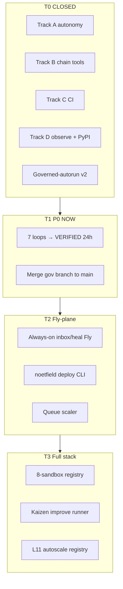

# [NOOS-AGENT-20260702-027] Unified Autonomy Upgrade Master v1

<!--
NOOS-AGENT-DOC
agent_id: noetfeld-os-cursor-chat
agent_lane: NOETFELD-OS
trace_id: NOOS-AGENT-20260702-027
doc_type: UNIFIED_UPGRADE_MASTER
workspace_root: /Users/sinakazemnezhad/Projects/noetfeld-os
classification: INTERNAL — combined tiered upgrade backlog
authority: governed-autorun L1-L12, UPGRADE_MANIFEST.json, NOOS-AGENT-20260702-025
related_docs: NOOS-AGENT-20260702-025, NOOS-AGENT-20260702-026, NOOS-AGENT-20260702-024, NOOS-AGENT-20260615-014
machine_backlog: data/noos-unified-upgrade-backlog-v1.json
manifest: docs/_NOOS_AGENT/MANIFEST.json
-->

**Status:** ACTIVE · 2026-07-02  
**Goal:** Fly.io-grade autonomous full stack — always-on runtime + governed control plane  
**Machine backlog:** `data/noos-unified-upgrade-backlog-v1.json` (62 items, tiered)  
**Upgrade planes:** `data/noos-upgrade-planes-v1.json` · [NOOS-AGENT-20260702-028]([NOOS-AGENT-20260702-028]_TEN_UPGRADE_PLANES_v1.md) · `make planes`  
**Sprint plans:** [NOOS-AGENT-20260702-029]([NOOS-AGENT-20260702-029]_TEN_10_STEP_UPGRADE_PLANS_v1.md) · `make plan PLANE=GOV`

---

## Ten upgrade planes (028)

Ten parallel machine lanes (A–I + GOV), each with a 10-step ladder (100 steps total). COM is excluded — FOUNDER lane only (L7).

| Command | Purpose |
|---------|---------|
| `make planes` | JSON status: tier, progress, next open step per plane |
| `make plan PLANE=GOV` | Sprint-grade 10-step plan for one plane |
| `make plans-all` | List all planes + next step |
| `make schedule-verify` | Plane A verify |
| `make determinism-verify` | Plane GOV verify |
| `make loop-heartbeat` | Plane I + H verify |

See **[NOOS-AGENT-20260702-028]_TEN_UPGRADE_PLANES_v1.md** for per-plane overview and **[NOOS-AGENT-20260702-029]_TEN_10_STEP_UPGRADE_PLANS_v1.md** for sprint execution tables.

---

## Tier model

| Tier | Meaning | Count | Agent action |
|------|---------|-------|--------------|
| **T0** | CLOSED — evidence on disk | 13 | Do not re-open unless DRIFT (L12) |
| **T1** | P0 NOW — 24/7 VERIFIED + merge | 8 | Start immediately |
| **T2** | P1 NEAR — always-on + deploy CLI | 10 | After T1 green |
| **T3** | P2 MID — sandbox fleet + autoscale | 6 | After T2 stable |
| **T4** | P3 LATER — migration, legal, Phase 5+ | 7 | Triggered only |
| **FOUNDER** | Founder-gated (L7) | 9 | Never blocks machine |

---

## Architecture target



**Gap today:** autonomous *orchestration* (GHA loops + CF motors) without autonomous *runtime* (always-on processes). Fly.io never sleeps; NOOS loops wake every 5–60m.

---

## T0 — CLOSED (do not re-do)

### Track A — Factory autonomy
| ID | Item | Evidence |
|----|------|----------|
| A1 | Native GitHub schedule backup | `make schedule-verify` · 2+ success runs |
| A2–A9 | CF motor, cloud_meta, dashboard, inbox | Receipt 026 |
| A10 | 24h CF+dispatch proof | `verify_noos_autonomous_24h_v1.py` |
| LOOP-FLEET | 7 domain loops + CF fleet motor | `data/noos-24-7-loops-v1.json` |

### Track B — Phase 4 chain tools
UPG-0151–0158, 0159, 0160 — all in `UPGRADE_MANIFEST.json`.

### Track C — CI hardening
UPG-0191–0197 — `gel-ci.yml` + dependabot + gitleaks + SBOM.

### Track D — Observe + publish
| UPG | Item |
|-----|------|
| 0161 | TestPyPI dispatch path |
| 0162 | PyPI production v0.1.0 live |
| 0163 | `release-noetfield-gate.yml` tag workflow |
| D1 | SourceA observe loop |

### Governance
GOV-L7-L12 — v2 cycle receipts, L11 cost, L8 sink invariant, L12 drift heartbeat.

---

## T1 — P0 NOW (agent to-do)

| ID | Action | Success | Owner |
|----|--------|---------|-------|
| MERGE-GOV-BRANCH | Merge `cursor/governed-autorun-l11-l12-heartbeat` + A1/release to `main` | Clean tree on main | machine |
| LOOP-VERIFY-inbox | 24h schedule-only inbox loop | 2+ schedule runs, sink PASS | machine |
| LOOP-VERIFY-self_heal | 24h self-heal + daily heartbeat | drift=0 | machine |
| LOOP-VERIFY-runtime | 24h gate+pytest | schedule cycles green | machine |
| LOOP-VERIFY-surface | 24h production URLs | external L4 PASS | machine |
| LOOP-VERIFY-chain | 24h verify+decide validate | schedule cycles green | machine |
| LOOP-VERIFY-sourcea | 24h SourceA observe | receipt FRESH or STALE labeled | machine |
| LOOP-VERIFY-agent_nerve | 24h agent docs | schedule cycles green | machine |

**Law:** A loop is **DECLARED** until 24h zero-manual window on `schedule` receipts closes green → then **VERIFIED** (governed-autorun L109). Manual dispatch does not count.

---

## T2 — P1 NEAR (Fly-plane + deploy)

| UPG | Track | Action | Fly.io analog |
|-----|-------|--------|---------------|
| 0201 | E | `fly.toml` + Dockerfile inbox daemon | `fly launch` |
| 0202 | E | `/health` + `/ready` on runners | Fly checks |
| 0203 | F | `noetfield deploy --scope` unified CLI | `fly deploy` |
| 0204 | F | Drift → Kaizen auto-deploy (L12) | auto-rollback |
| 0205 | H | Queue-depth inbox scaler | autoscale |
| 0206 | E | Self-heal loop → Fly always-on | always-on Machine |
| 0207 | A | Deprecate factory autorun monolith | retire cron job |
| 0164 | D | PyPI README 3-line → full docs | packaging |
| 0168 | D | GitHub Action gate example | CI template |
| 0169 | D | Pre-commit hook example | dev UX |

**Sequence:** 0201 → 0202 → 0203 → (0205 ∥ 0206) → 0204 → 0207.

---

## T3 — P2 MID (full-stack sandbox fleet)

| UPG | Action |
|-----|--------|
| 0208 | Private mesh — gel-api internal URL for loops |
| 0209 | Multi-region canary (yyz + ord) |
| 0210 | Per-sandbox DECLARED/VERIFIED in autorun-status |
| 0211 | `noos-improve` Kaizen runner (1 machine_safe/day) |
| 0212 | `data/noos-runtime-scaling-v1.json` — L11 throttle rules |
| SANDBOX-REGISTRY | 8 sandboxes: inbox, chain, surface, sourcea, improve, gel-api, www, cf |

---

## T4 — P3 LATER (triggered only)

| ID | Trigger | Action |
|----|---------|--------|
| UPG-0213 | Railway drift/cost pain | gel-api → Fly migration |
| UPG-0167 | Legal/org approved | npm `@noetfield/gate` publish |
| UPG-0174/0175 | Founder vault policy | secrets + policy pack semver |
| UPG-0170 | Demand | Homebrew tap stub |
| ECOSYSTEM-E | After C-01 | Nav refactor, SOC2 public claims |
| PHASE-5 | T1+T2 green | Tenant & Production UPG 0177+ |

---

## FOUNDER lane (L7 — never blocks machine)

| ID | Item | Status |
|----|------|--------|
| NOOS-C-01 | First Trust Brief / AI Value OS briefing | founder_blocked P0 |
| UPG-0001–0004 | NW1/SW1 sends | founder_blocked |
| UPG-0005 | Demo video W1 | in_progress |
| UPG-0029–0030 | Screen capture + publish link | blocked on 0005 |
| UPG-0010 | Founder verify gate | founder_blocked |

Present in every cycle receipt with count/oldest/priority/age. Escalate P0 past 24h in heartbeat.

---

## Combined track map (all plans unified)

| Track | Source plan | Status |
|-------|-------------|--------|
| A | Three-track v2 · Autonomy | T0 closed · T1 verify · T2 deprecate monolith |
| B | Three-track v2 · Phase 4 | T0 closed |
| C | Three-track v2 · CI | T0 closed |
| D | Three-track v2 + Ecosystem 024 | T0 mostly · T2 packaging docs |
| E | Fly brainstorm · Always-on | T2 |
| F | Fly brainstorm · Deploy reconciler | T2 |
| G | Fly brainstorm · Edge mesh | T3 |
| H | Fly brainstorm · L11 autoscale | T2–T3 |
| I | Fly brainstorm · Sandbox fleet | T1 verify → T3 registry |
| GOV | governed-autorun skill | T0 receipts · T1 merge |
| COM | Ecosystem Phase C + UPG 0001–0007 | FOUNDER |

---

## Agent execution order (locked)

1. **T1** — Merge gov branch → start 24h VERIFIED windows (parallel per loop)
2. **T2** — UPG-0201 inbox Fly runner (first always-on bite)
3. **T2** — UPG-0203 deploy CLI (unify 5 deploy scripts)
4. **T2** — UPG-0206 self-heal Fly + UPG-0205 scaler
5. **T3** — Sandbox registry + Kaizen runner
6. **T4** — Only on explicit trigger
7. **FOUNDER** — parallel; never occupies scheduler slot

---

## Verification commands

```bash
# Tier status
python3 -c "import json; d=json.load(open('data/noos-unified-upgrade-backlog-v1.json')); print(d['summary'])"

# T1 loop verify
make schedule-verify
make loop-heartbeat
make autorun-status

# T0 autonomy
make autonomous-verify
```

---

**Locked by:** noetfeld-os-cursor-chat · 2026-07-02
