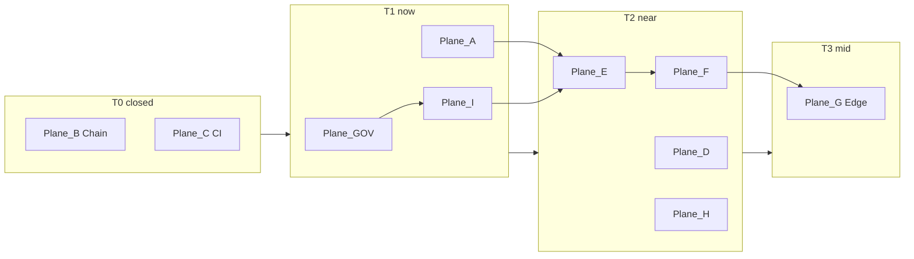

# [NOOS-AGENT-20260702-028] Ten Upgrade Planes v1

<!--
NOOS-AGENT-DOC
agent_id: noetfeld-os-cursor-chat
agent_lane: NOETFELD-OS
trace_id: NOOS-AGENT-20260702-028
doc_type: UPGRADE_PLANES_10x10
workspace_root: /Users/sinakazemnezhad/Desktop/Noetfield-Systems/noetfeld-OS
classification: INTERNAL — 10 parallel upgrade planes × 10 steps
authority: NOOS-AGENT-20260702-027, governed-autorun L1-L13
related_docs: NOOS-AGENT-20260702-025, NOOS-AGENT-20260702-027, NOOS-AGENT-20260615-014
machine_registry: data/noos-upgrade-planes-v1.json
manifest: docs/_NOOS_AGENT/MANIFEST.json
-->

**Status:** ACTIVE · 2026-07-02  
**Scope:** 10 machine upgrade planes (A–I + GOV) · 100 steps total · COM excluded (FOUNDER lane L7)  
**Machine SSOT:** `data/noos-upgrade-planes-v1.json` · `make planes`

---

## Plane overview

| Plane | ID | Tier | Win condition | Verify |
|-------|----|------|---------------|--------|
| Factory Autonomy | `A` | T1 | 7/7 schedule-verified; monolith deprecated | `make schedule-verify` |
| Chain Tools | `B` | T0 | gate/decide/verify CLI + CI integration | `noetfield verify --json` |
| CI & Quality | `C` | T0 | gel-ci + determinism gate | `pytest -q` |
| Ecosystem | `D` | T2 | SourceA observe + packaging docs | `scripts/observe_sourcea_supabase_v1.py` |
| Always-on | `E` | T2 | Fly inbox + self-heal | Fly `/health` 200 |
| Deploy | `F` | T2 | `noetfield deploy --scope` + drift Kaizen | deploy receipt |
| Edge | `G` | T3 | private mesh + multi-region | external L4 both regions |
| Autoscale | `H` | T2 | L11 THROTTLED_ROI + queue scaler | `make loop-heartbeat` |
| Sandbox fleet | `I` | T1 | 7 loops VERIFIED + 8-sandbox registry | `make loop-heartbeat` |
| Governance | `GOV` | T1 | L1–L13 on main; D1–D8 closed | `make determinism-verify` |



---

## Execution order (locked)

1. **GOV G7** — merge `cursor/governed-autorun-l11-l12-heartbeat` → `main`
2. **I I2–I8** — parallel 24h VERIFIED windows (schedule-only; manual dispatch ≠ proof)
3. **GOV G9** — D2 CAS in `noos_loop_runner_v1.py` (highest-ROI Kaizen after D4)
4. **E E1** — UPG-0201 inbox Fly runner
5. **F F1** — UPG-0203 deploy CLI
6. **E+H** — E3 self-heal Fly + H2 queue scaler (parallel)
7. **I+GOV** — I9–I10 sandbox registry + G10 determinism closeout (D1 upsert + D5 replay)

---

## Plane A — Factory Autonomy

**Win:** ≥2 consecutive `schedule` runs · factory FRESH · zero manual dispatch · UPG-0207 monolith retired.

| Step | ID | Status | Action | Success check |
|------|-----|--------|--------|---------------|
| 1 | A1 | done | Schedule proof via Supabase truth_log | `make schedule-verify ok` |
| 2 | A2 | done | Scheduled workflows enabled | schedule runs on main |
| 3 | A3 | done | CF cron → repository_dispatch | no Cursor manual |
| 4 | A4 | done | cloud_trigger + cloud_meta in sink | Supabase row |
| 5 | A5 | done | autorun-status FRESH | age < 30m |
| 6 | A6 | done | founder_blocked every cycle | NOOS-C-01 blocked |
| 7 | A7 | done | IDLE_NO_WORK + idle_reason | cycle receipt |
| 8 | A8 | done | Dashboard v1.3 | read-only status |
| 9 | A9 | done | Inbox freshness on dashboard | founder count |
| 10 | A10 | open | 24h proof + deprecate monolith | UPG-0207 after LOOP-VERIFY-ALL |

**Key files:** `.github/workflows/noos-factory-autorun.yml`, `scripts/run_noetfield_factory_loop_v1.py`, `data/noos-24-7-loops-v1.json`

---

## Plane B — Chain Tools

**Win:** UPG-0151–0158 live · integration tests in gel-ci.

| Step | ID | Status | UPG | Action |
|------|-----|--------|-----|--------|
| 1–8 | B1–B8 | done | 0151–0158 | gate/decide/verify CLI handlers |
| 9 | B9 | done | 0159 | Integration gate in CI |
| 10 | B10 | done | 0160 | Decide local-server integration |

---

## Plane C — CI & Quality

**Win:** `main` protected by pytest + gate + agent-docs + determinism.

| Step | ID | Status | UPG | Action |
|------|-----|--------|-----|--------|
| 1–8 | C1–C8 | done | 0191–0197 | gel-ci hardening |
| 9 | C9 | done | — | CI lane separate from factory autorun |
| 10 | C10 | done | 0214 | Determinism external-verify gate |

---

## Plane D — Ecosystem Observe & Packaging

**Win:** SourceA observe FRESH on cron · PyPI path · dev UX examples.

| Step | ID | Status | Backlog | Action |
|------|-----|--------|---------|--------|
| 1–5 | D1–D5 | done | D1, UPG-0161–0163 | observe + publish path |
| 6 | D6 | open | LOOP-VERIFY-sourcea | observe FRESH on schedule |
| 7–9 | D7–D9 | open | UPG-0164–0169 | README, GH Action, pre-commit examples |
| 10 | D10 | deferred | UPG-0170 | Homebrew tap stub |

---

## Plane E — Always-on Runtime (Fly-plane)

**Win:** Fly inbox daemon + self-heal always-on · `/health` L4 PASS.

| Step | ID | Status | Backlog | Action |
|------|-----|--------|---------|--------|
| 1 | E1 | open | UPG-0201 | fly.toml + Dockerfile inbox |
| 2 | E2 | open | UPG-0202 | /health + /ready |
| 3 | E3 | open | UPG-0206 | self-heal → Fly |
| 4–5 | E4–E5 | open | — | drain + CF fallback |
| 6–10 | E6–E10 | deferred | UPG-0213+ | gel-api migrate, fleet registry |

**Depends on:** Plane I (LOOP-VERIFY-inbox) · Plane A (schedule backup)

---

## Plane F — Deploy Reconciler

**Win:** `noetfield deploy --scope` · drift → Kaizen auto-rollback.

| Step | ID | Status | Backlog | Action |
|------|-----|--------|---------|--------|
| 1–3 | F1–F3 | open | UPG-0203 | unified deploy CLI + receipts |
| 4–5 | F4–F5 | open | UPG-0204 | drift Kaizen + rollback |
| 6–8 | F6–F8 | open | UPG-0203 | gel-api, www, CF scopes |
| 9–10 | F9–F10 | deferred | — | Studio scope, CI dry-run |

---

## Plane G — Edge & Private Mesh

**Win:** loops use internal gel-api URL · yyz+ord canary L4 verified.

| Step | ID | Status | Backlog | Action |
|------|-----|--------|---------|--------|
| 1–2 | G1–G2 | open | UPG-0208 | private mesh internal URL |
| 3–4 | G3–G4 | open | UPG-0209 | multi-region canary |
| 5–10 | G5–G10 | deferred | — | edge routing, VPC, failover |

---

## Plane H — Autoscale & ROI (L11)

**Win:** queue scaler reacts · THROTTLED_ROI rules in registry.

| Step | ID | Status | Backlog | Action |
|------|-----|--------|---------|--------|
| 1 | H1 | done | GOV-L7-L12 | cost on every receipt |
| 2 | H2 | open | UPG-0205 | queue-depth scaler |
| 3–5 | H3–H5 | open | UPG-0212 | scaling registry + backpressure |
| 6–10 | H6–H10 | deferred | — | budgets, ROI dashboard, Fly scale |

---

## Plane I — Sandbox Fleet

**Win:** 7/7 loops DECLARED→VERIFIED · 8-sandbox registry.

| Step | ID | Status | Backlog | Action |
|------|-----|--------|---------|--------|
| 1 | I1 | done | LOOP-FLEET | 7 loops deployed |
| 2–7 | I2–I7 | open | LOOP-VERIFY-* | per-loop 24h VERIFIED |
| 8 | I8 | open | LOOP-VERIFY-ALL | umbrella close |
| 9 | I9 | open | UPG-0210 | SLA in autorun-status |
| 10 | I10 | open | SANDBOX-REGISTRY | 8-sandbox fleet |

**Law:** Manual `workflow_dispatch` green ≠ cron green (governed-autorun L4 / L109).

---

## Plane GOV — Governance & Determinism

**Win:** v3 laws on main · D1–D8 gap closed · one machine_safe Kaizen/cycle max.

| Step | ID | Status | Backlog / rule | Action |
|------|-----|--------|----------------|--------|
| 1–5 | G1–G5 | done | L7–L12 | cycle receipts + heartbeat |
| 6 | G6 | done | UPG-0214 | determinism CI gate |
| 7 | G7 | open | MERGE-GOV-BRANCH | merge gov branch → main |
| 8 | G8 | done | D4 | sink-ack gates COMPLETE |
| 9 | G9 | open | D2 | CAS in loop runner |
| 10 | G10 | open | D1, D5 | op_key upsert + nightly replay |

**Kaizen queue:** G9 (D2 CAS) — next after D4 closeout.

---

## Verification

```bash
make planes                    # JSON status all 10 planes
make schedule-verify           # Plane A
make determinism-verify        # Plane GOV
make loop-heartbeat            # Plane I + H
python3 scripts/planes_status_v1.py --write-receipt --json
```

---

## Scope boundaries

| In scope | Out of scope |
|----------|--------------|
| NOOS loops, gate, CI, Fly runners | TrustField / SourceA product edits |
| Supabase + GitHub Actions + CF | `phase_reconciler_v1` replacement |
| COM founder lane in cycle receipts | COM as upgrade plane slot |

---

**Locked by:** noetfeld-os-cursor-chat · 2026-07-02
