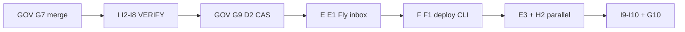
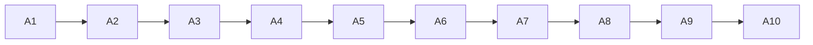
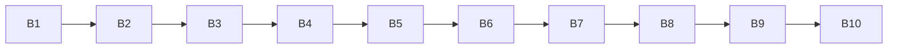
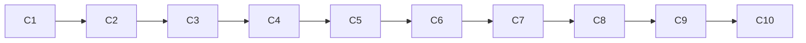
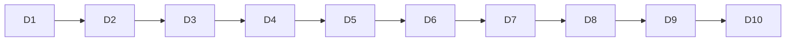
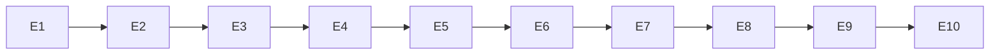
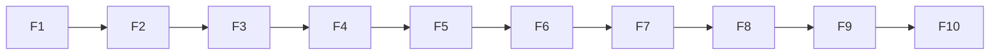
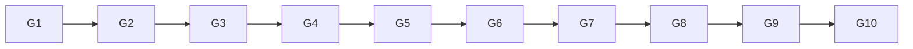
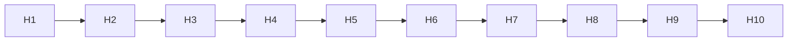
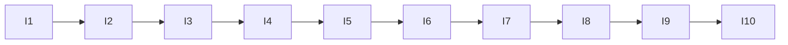

# [NOOS-AGENT-20260702-029] Ten 10-Step Upgrade Plans v1

<!--
NOOS-AGENT-DOC
agent_id: noetfeld-os-cursor-chat
agent_lane: NOETFELD-OS
trace_id: NOOS-AGENT-20260702-029
doc_type: UPGRADE_PLAN_10_STEP
workspace_root: /Users/sinakazemnezhad/Projects/noetfeld-os
classification: INTERNAL — sprint-grade 10-step plans for all upgrade planes
authority: NOOS-AGENT-20260702-028, data/noos-upgrade-planes-v1.json
related_docs: NOOS-AGENT-20260702-025, NOOS-AGENT-20260702-027, NOOS-AGENT-20260702-028
machine_registry: data/noos-upgrade-planes-v1.json
manifest: docs/_NOOS_AGENT/MANIFEST.json
-->

**Status:** ACTIVE · 2026-07-02  
**Scope:** 10 sprint-grade plans (A–I + GOV) · 10 steps each · synced from JSON SSOT  
**Commands:** `make plan PLANE=GOV` · `make plans-all` · `make planes`

> Supersedes **NOOS-AGENT-20260702-025** for execution (tracks A/B/C retained as historical closeout only).

---

## Global execution rule

**GOV → I → GOV → E → F → E+H → I+GOV** — locked order:

1. **GOV G7** — merge gov branch → `main`
2. **I I2–I8** — parallel 24h VERIFIED windows (`event=schedule` only; manual dispatch ≠ proof)
3. **GOV G9** — D2 CAS in loop runner (Kaizen)
4. **E E1** — UPG-0201 inbox Fly runner
5. **F F1** — UPG-0203 deploy CLI
6. **E+H** — E3 self-heal Fly + H2 queue scaler (parallel)
7. **I+GOV** — I9–I10 sandbox registry + G10 determinism closeout



---

<!-- GENERATED BODY: ten plane sections -->

## Plane A — Factory Autonomy (10 steps)

**Win condition:** 7/7 loops schedule-verified; factory monolith deprecated
**Tier:** T1 · **Progress:** 9/10 · **Verify:** `make schedule-verify`
**Depends on planes:** GOV



**Start order (open steps):** A10

<!-- GENERATED: sync from plane_plan_v1.py -->

| Step | ID | Priority | Status | Action | Success check | Verify | Backlog |
|------|-----|----------|--------|--------|---------------|--------|---------|
| 1 | A1 | P0 | done | Poll GitHub/Supabase for schedule proof | make schedule-verify ok | `make schedule-verify` | A1 |
| 2 | A2 | P0 | done | Scheduled workflows enabled on private repo | schedule runs on main | `make schedule-verify` | A2-A9 |
| 3 | A3 | P0 | done | CF cron → repository_dispatch bridge | no Cursor manual dispatch | `make autonomous-verify` | A2-A9 |
| 4 | A4 | P0 | done | Persist cloud_trigger + cloud_meta in factory sink | Supabase row with cloud_meta | `make autorun-status` | A2-A9 |
| 5 | A5 | P0 | done | make autorun-status → factory FRESH | age < 30m | `make autorun-status` | A2-A9 |
| 6 | A6 | P0 | done | founder_blocked every cycle receipt | NOOS-C-01 blocked | `make loop-heartbeat` | A2-A9 |
| 7 | A7 | P1 | done | Empty queue → IDLE_NO_WORK + idle_reason | cycle receipt fields | `make autorun-status` | A2-A9 |
| 8 | A8 | P1 | done | Dashboard v1.3 — factory + schedule run age | read-only dashboard | `make autorun-status` | A2-A9 |
| 9 | A9 | P1 | done | Dashboard inbox freshness from timestamps | founder count visible | `make autorun-status` | A2-A9 |
| 10 | A10 | P1 | open | 24h zero-manual proof + deprecate factory monolith | schedule-only 24h + UPG-0207 | `make autonomous-verify` | A10, UPG-0207 |

**Key files:** `.github/workflows/noos-factory-autorun.yml`, `scripts/run_noetfield_factory_loop_v1.py`, `data/noos-24-7-loops-v1.json`

## Plane B — Chain Tools (10 steps)

**Win condition:** noetfield gate/decide/verify CLI live; integration tests in CI
**Tier:** T0 · **Progress:** 10/10 · **Verify:** `noetfield verify --json`
**Depends on planes:** A

> CLOSED — evidence on disk. Do not re-open unless L12 drift.




<!-- GENERATED: sync from plane_plan_v1.py -->

| Step | ID | Priority | Status | Action | Success check | Verify | Backlog |
|------|-----|----------|--------|--------|---------------|--------|---------|
| 1 | B1 | P0 | done | UPG-0151 PyPI metadata / pyproject verify | pyproject valid | `noetfield gate --json` | B1-B10, UPG-0151 |
| 2 | B2 | P0 | done | UPG-0152 noetfield gate --json | gate JSON output | `noetfield gate --json` | B1-B10, UPG-0152 |
| 3 | B3 | P0 | done | UPG-0153 noetfield gate --strict | strict mode PASS | `noetfield gate --strict` | B1-B10, UPG-0153 |
| 4 | B4 | P0 | done | UPG-0156 decide --validate-only | schema validation | `noetfield decide --validate-only fixtures/demo_intents/approve.json` | B1-B10, UPG-0156 |
| 5 | B5 | P0 | done | UPG-0158 noetfield verify subcommand | verify JSON | `noetfield verify --json` | B1-B10, UPG-0158 |
| 6 | B6 | P1 | done | UPG-0157 dated receipt dir | ~/.noetfield/receipts/YYYY-MM-DD | `noetfield gate` | B1-B10, UPG-0157 |
| 7 | B7 | P1 | done | UPG-0154 gate G6 pytest check | gate --pytest | `noetfield gate --pytest` | B1-B10, UPG-0154 |
| 8 | B8 | P1 | done | UPG-0155 PRODUCT_TRUTH alignment | G7 phase check | `noetfield gate --json` | B1-B10, UPG-0155 |
| 9 | B9 | P1 | done | UPG-0159 integration test gate in CI | gel-ci integration step | `pytest -q tests/test_gate_integration_ci.py` | D2, UPG-0159 |
| 10 | B10 | P1 | done | UPG-0160 decide integration + manifest close | gel-ci decide step | `pytest -q tests/test_decide_integration_ci.py` | D2, UPG-0160, B1-B10 |

**Key files:** `noetfield_gate/`, `tests/test_noetfield_gate.py`

## Plane C — CI and Quality (10 steps)

**Win condition:** main protected by pytest + gate + agent-doc + determinism checks
**Tier:** T0 · **Progress:** 10/10 · **Verify:** `pytest -q`
**Depends on planes:** A

> CLOSED — evidence on disk. Do not re-open unless L12 drift.




<!-- GENERATED: sync from plane_plan_v1.py -->

| Step | ID | Priority | Status | Action | Success check | Verify | Backlog |
|------|-----|----------|--------|--------|---------------|--------|---------|
| 1 | C1 | P0 | done | UPG-0191 pytest on push/PR | gel-ci pytest green | `pytest -q` | C1-C10, UPG-0191 |
| 2 | C2 | P0 | done | Cloud worker handler wired | inbox handler ok | `pytest -q` | C1-C10 |
| 3 | C3 | P0 | done | UPG-0192 check_noos_agent_docs in CI | vault tags pass | `bash scripts/check_noos_agent_docs.sh` | C1-C10, UPG-0192 |
| 4 | C4 | P0 | done | UPG-0194 noetfield gate required in CI | gate step green | `noetfield gate --json` | C1-C10, UPG-0194 |
| 5 | C5 | P1 | done | UPG-0193 business strategy check | continue-on-error wired | `bash scripts/check_noetfield_business_strategy.sh` | C1-C10, UPG-0193 |
| 6 | C6 | P1 | done | UPG-0195 Dependabot pip weekly | dependabot.yml present | `test -f .github/dependabot.yml` | C1-C10, UPG-0195 |
| 7 | C7 | P1 | done | UPG-0197 gitleaks secret scan | gitleaks in gel-ci | `grep gitleaks .github/workflows/gel-ci.yml` | C1-C10, UPG-0197 |
| 8 | C8 | P1 | done | UPG-0196 SBOM + pip-audit artifact | sbom artifact uploaded | `grep cyclonedx .github/workflows/gel-ci.yml` | C1-C10, UPG-0196 |
| 9 | C9 | P1 | done | CI lane separate from factory autorun | gel-ci no secrets | `grep -L secrets .github/workflows/gel-ci.yml` | C1-C10 |
| 10 | C10 | P1 | done | Determinism gate UPG-0214 in gel-ci | make determinism-verify ok | `make determinism-verify` | UPG-0214 |

**Key files:** `.github/workflows/gel-ci.yml`, `.github/dependabot.yml`

## Plane D — Ecosystem Observe and Packaging (10 steps)

**Win condition:** SourceA observe FRESH; PyPI publish path; dev UX examples shipped
**Tier:** T2 · **Progress:** 5/10 · **Verify:** `python3 scripts/observe_sourcea_supabase_v1.py --json`
**Depends on planes:** B, C



**Start order (open steps):** D6 → D7 → D8 → D9 → D10

<!-- GENERATED: sync from plane_plan_v1.py -->

| Step | ID | Priority | Status | Action | Success check | Verify | Backlog |
|------|-----|----------|--------|--------|---------------|--------|---------|
| 1 | D1 | P1 | done | SourceA Supabase observe loop | noos_sourcea_observe_loop_tick | `python3 scripts/observe_sourcea_supabase_v1.py --json` | D1 |
| 2 | D2 | P1 | done | UPG-0159/0160 integration in gel-ci | integration steps green | `pytest -q tests/test_gate_integration_ci.py tests/test_decide_integration_ci.py` | D2 |
| 3 | D3 | P1 | done | UPG-0161 TestPyPI trusted publish path | publish-pypi workflow_dispatch | `test -f .github/workflows/publish-pypi.yml` | UPG-0161 |
| 4 | D4 | P1 | done | UPG-0162 noetfield-gate on PyPI | pypi 200 | `curl -sf https://pypi.org/pypi/noetfield-gate/json | head -1` | UPG-0162 |
| 5 | D5 | P1 | done | UPG-0163 tag release workflow | release-noetfield-gate.yml on main | `test -f .github/workflows/release-noetfield-gate.yml` | UPG-0163 |
| 6 | D6 | P2 | open | SourceA observe FRESH on schedule cron | observe receipt FRESH or STALE labeled | `python3 scripts/observe_sourcea_supabase_v1.py --json` | LOOP-VERIFY-sourcea |
| 7 | D7 | P2 | open | UPG-0164 PyPI README 3-line → full docs | pypi links noetfield.com/gel | `grep -i gel pyproject.toml README.md` | UPG-0164 |
| 8 | D8 | P2 | open | UPG-0168 GitHub Action gate example | example workflow in docs | `test -f docs/examples/noetfield-gate-action.yml || echo pending` | UPG-0168 |
| 9 | D9 | P2 | open | UPG-0169 pre-commit hook example | docs snippet + stub | `grep -r pre-commit docs/ || echo pending` | UPG-0169 |
| 10 | D10 | P3 | deferred | T4 deferred: Homebrew stub, npm publish, vault policy, Phase 5 | docs stub only | `test -f docs/ops/HOMEBREW_TAP_STUB.md || echo deferred` | UPG-0170, UPG-0167, UPG-0174, UPG-0175, PHASE-5 |

**Key files:** `scripts/observe_sourcea_supabase_v1.py`, `.github/workflows/publish-pypi.yml`, `.github/workflows/release-noetfield-gate.yml`

## Plane E — Always-on Runtime (10 steps)

**Win condition:** Fly inbox + self-heal always-on; /health external L4 PASS
**Tier:** T2 · **Progress:** 0/10 · **Verify:** `curl -sf https://<fly-app>/health`
**Depends on planes:** I, A



**Start order (open steps):** E1 → E2 → E3 → E4 → E5 → E6 → E7 → E8 → E9 → E10

<!-- GENERATED: sync from plane_plan_v1.py -->

| Step | ID | Priority | Status | Action | Success check | Verify | Backlog |
|------|-----|----------|--------|--------|---------------|--------|---------|
| 1 | E1 | P1 | open | UPG-0201 fly.toml + Dockerfile inbox daemon | Fly app /health 200 | `fly status` | UPG-0201 |
| 2 | E2 | P1 | open | UPG-0202 /health + /ready on runners | external L4 PASS | `curl -sf /health` | UPG-0202 |
| 3 | E3 | P1 | open | UPG-0206 migrate self-heal loop to Fly | sub-minute reenqueue | `fly logs` | UPG-0206 |
| 4 | E4 | P2 | open | Inbox worker always-on drain | pending queue < 5 steady | `make autorun-status` | UPG-0201 |
| 5 | E5 | P2 | open | CF motor fallback retained | schedule backup if Fly down | `make schedule-verify` | A1 |
| 6 | E6 | P3 | deferred | UPG-0213 gel-api Railway → Fly | api.noetfield.com L4 post-migrate | `curl api.noetfield.com/health` | UPG-0213 |
| 7 | E7 | P3 | deferred | Multi-loop Fly fleet registry | one app per critical loop | `fly apps list` | E7 |
| 8 | E8 | P3 | deferred | Fly secrets via vault policy | no plaintext in fly.toml | `fly secrets list` | UPG-0174 |
| 9 | E9 | P3 | deferred | Fly autoscale machines | scale on queue depth | `fly scale show` | UPG-0205 |
| 10 | E10 | P3 | deferred | Retire GHA-only inbox when Fly stable | Fly primary path | `make planes` | UPG-0207 |

**Key files:** `fly.toml`, `Dockerfile`

## Plane F — Deploy Reconciler (10 steps)

**Win condition:** noetfield deploy --scope unified; drift Kaizen auto-rollback
**Tier:** T2 · **Progress:** 0/10 · **Verify:** `noetfield deploy --scope gel-api --dry-run`
**Depends on planes:** E



**Start order (open steps):** F1 → F2 → F3 → F4 → F5 → F6 → F7 → F8 → F9 → F10

<!-- GENERATED: sync from plane_plan_v1.py -->

| Step | ID | Priority | Status | Action | Success check | Verify | Backlog |
|------|-----|----------|--------|--------|---------------|--------|---------|
| 1 | F1 | P1 | open | UPG-0203 noetfield deploy --scope CLI | one receipt per surface | `noetfield deploy --help` | UPG-0203 |
| 2 | F2 | P1 | open | Unify 5 deploy scripts under CLI | single entrypoint | `grep deploy scripts/` | UPG-0203 |
| 3 | F3 | P1 | open | Deploy receipt schema v1 | receipt per deploy | `noetfield deploy --json` | UPG-0203 |
| 4 | F4 | P1 | open | UPG-0204 drift auto-deploy Kaizen | drift → machine_safe fix | `make loop-heartbeat` | UPG-0204 |
| 5 | F5 | P2 | open | Auto-rollback on regression | failed verify → revert | `noetfield deploy --rollback` | UPG-0204 |
| 6 | F6 | P2 | open | gel-api deploy scope | api.noetfield.com health | `bash scripts/check_production_urls.sh` | UPG-0203 |
| 7 | F7 | P2 | open | www deploy scope | www.noetfield.com 200 | `make urls` | UPG-0203 |
| 8 | F8 | P2 | open | CF worker deploy scope | fleet motor live | `make loop-fleet-dispatch` | UPG-0203 |
| 9 | F9 | P3 | deferred | Studio Supabase deploy scope | boundary exists | `bash scripts/check_noos_live_sync_gate.sh` | F9 |
| 10 | F10 | P3 | deferred | Deploy dry-run in gel-ci | no secrets in CI deploy | `grep deploy .github/workflows/gel-ci.yml` | F10 |

**Key files:** `noetfield_gate/deploy.py`

## Plane G — Edge and Private Mesh (10 steps)

**Win condition:** loops use internal gel-api URL; multi-region canary verified
**Tier:** T3 · **Progress:** 0/10 · **Verify:** `bash scripts/check_production_urls.sh`
**Depends on planes:** F



**Start order (open steps):** G1 → G2 → G3 → G4 → G5 → G6 → G7 → G8 → G9 → G10

<!-- GENERATED: sync from plane_plan_v1.py -->

| Step | ID | Priority | Status | Action | Success check | Verify | Backlog |
|------|-----|----------|--------|--------|---------------|--------|---------|
| 1 | G1 | P2 | open | UPG-0208 private mesh internal URL | loops never hit public api for health | `grep internal docs/ops/` | UPG-0208 |
| 2 | G2 | P2 | open | Wire loop health probes to mesh | internal URL in loop config | `make loop-heartbeat` | UPG-0208 |
| 3 | G3 | P2 | open | UPG-0209 multi-region canary yyz+ord | external verify both regions | `bash scripts/check_production_urls.sh` | UPG-0209 |
| 4 | G4 | P2 | open | L4 verify both regions post-deploy | FULL-body hash match | `bash scripts/check_production_urls.sh` | UPG-0209 |
| 5 | G5 | P3 | deferred | CF edge routing for gel-api | edge cache rules | `curl -I api.noetfield.com` | G5 |
| 6 | G6 | P3 | deferred | Private VPC for Fly↔Railway | no public health from loops | `fly wireguard` | G6 |
| 7 | G7 | P3 | deferred | mTLS doc for enterprise tier | UPG-0214 enterprise doc | `grep mTLS docs/` | UPG-0214 |
| 8 | G8 | P3 | deferred | Regional failover playbook | ord down → yyz primary | `docs/ops/` | G8 |
| 9 | G9 | P3 | deferred | Edge latency SLO registry | p99 < 200ms | `data/noos-runtime-scaling-v1.json` | UPG-0212 |
| 10 | G10 | P3 | deferred | Mesh verify in nightly loop | surface loop L4 both regions | `make loop-run EVENT=noos_surface_loop_tick` | G10 |

**Key files:** `docs/ops/GEL_API_DEPLOY_LOCKED_v1.md`

## Plane H — Autoscale and ROI (10 steps)

**Win condition:** L11 THROTTLED_ROI rules live; queue scaler reacts
**Tier:** T2 · **Progress:** 1/10 · **Verify:** `make loop-heartbeat`
**Depends on planes:** E, GOV



**Start order (open steps):** H2 → H3 → H4 → H5 → H6 → H7 → H8 → H9 → H10
**Kaizen: L11 ROI — one scaler/throttle change per cycle max.**

<!-- GENERATED: sync from plane_plan_v1.py -->

| Step | ID | Priority | Status | Action | Success check | Verify | Backlog |
|------|-----|----------|--------|--------|---------------|--------|---------|
| 1 | H1 | P0 | done | L11 cost on every cycle receipt | cost + value_class fields | `make loop-heartbeat` | GOV-L7-L12 |
| 2 | H2 | P1 | open | UPG-0205 queue-depth inbox scaler | pending>10 → scale 1→2 | `make autorun-status` | UPG-0205 |
| 3 | H3 | P2 | open | UPG-0212 runtime scaling registry | THROTTLED_ROI per loop | `test -f data/noos-runtime-scaling-v1.json` | UPG-0212 |
| 4 | H4 | P2 | open | 30% none spend → THROTTLED_ROI | L11 enforcement | `make loop-heartbeat` | GOV-L7-L12 |
| 5 | H5 | P2 | open | Backpressure on inbox depth | admit rate capped | `make autorun-status` | UPG-0205 |
| 6 | H6 | P3 | deferred | Per-loop cost budget caps | monthly USD cap | `make planes` | H6 |
| 7 | H7 | P3 | deferred | ROI dashboard in autorun-status | value_class breakdown | `make autorun-status` | UPG-0210 |
| 8 | H8 | P3 | deferred | Auto-throttle low-ROI loops | THROTTLED_ROI state | `make loop-heartbeat` | H8 |
| 9 | H9 | P3 | deferred | Scaler integration with Fly | fly scale on depth | `fly scale show` | UPG-0205 |
| 10 | H10 | P3 | deferred | Scaling receipt per scale event | improvement-receipt-v2 | `receipts/proof/` | H10 |

**Key files:** `data/noos-runtime-scaling-v1.json`

## Plane I — Sandbox Fleet (10 steps)

**Win condition:** 7/7 loops VERIFIED 24h; 8-sandbox registry live
**Tier:** T1 · **Progress:** 1/10 · **Verify:** `make loop-heartbeat`
**Depends on planes:** GOV, A



**Start order (open steps):** I2 → I3 → I4 → I5 → I6 → I7 → I8 → I9 → I10

<!-- GENERATED: sync from plane_plan_v1.py -->

| Step | ID | Priority | Status | Action | Success check | Verify | Backlog |
|------|-----|----------|--------|--------|---------------|--------|---------|
| 1 | I1 | P0 | done | LOOP-FLEET 7 domain loops deployed | 7 loops dispatch green | `make loops-status` | LOOP-FLEET |
| 2 | I2 | P0 | open | LOOP-VERIFY-inbox 24h schedule-only | 2+ schedule runs sink PASS | `make verified-window` | LOOP-VERIFY-inbox |
| 3 | I3 | P0 | open | LOOP-VERIFY-self_heal 24h | heartbeat daily drift 0 | `make loop-heartbeat` | LOOP-VERIFY-self_heal |
| 4 | I4 | P0 | open | LOOP-VERIFY-runtime 24h | gate+pytest schedule cycles | `make verified-window` | LOOP-VERIFY-runtime |
| 5 | I5 | P0 | open | LOOP-VERIFY-surface 24h | check_production_urls schedule | `make urls` | LOOP-VERIFY-surface |
| 6 | I6 | P0 | open | LOOP-VERIFY-chain 24h | noetfield verify schedule | `noetfield verify --json` | LOOP-VERIFY-chain |
| 7 | I7 | P1 | open | LOOP-VERIFY-sourcea + agent_nerve | observe FRESH + agent docs | `python3 scripts/observe_sourcea_supabase_v1.py --json` | LOOP-VERIFY-sourcea, LOOP-VERIFY-agent_nerve |
| 8 | I8 | P0 | open | LOOP-VERIFY-ALL umbrella close | 7/7 DECLARED→VERIFIED | `make verified-window` | LOOP-VERIFY-ALL |
| 9 | I9 | P2 | open | UPG-0210 per-sandbox SLA in autorun-status | DECLARED|VERIFIED per sandbox | `make autorun-status` | UPG-0210 |
| 10 | I10 | P2 | open | SANDBOX-REGISTRY 8 sandboxes | one row per sandbox | `make autorun-status` | SANDBOX-REGISTRY, UPG-0211 |

**Key files:** `data/noos-24-7-loops-v1.json`, `scripts/noos_loop_runner_v1.py`, `scripts/open_noos_verified_window_v1.py`

## Plane GOV — Governance and Determinism (10 steps)

**Win condition:** governed-autorun L1–L13 on main; D1–D8 gap closed
**Tier:** T1 · **Progress:** 7/10 · **Verify:** `make determinism-verify`


**Start order (open steps):** G7 → G9 → G10

<!-- GENERATED: sync from plane_plan_v1.py -->

| Step | ID | Priority | Status | Action | Success check | Verify | Backlog |
|------|-----|----------|--------|--------|---------------|--------|---------|
| 1 | G1 | P0 | done | L7 founder_blocked never vanishes | every cycle receipt | `make loop-heartbeat` | GOV-L7-L12 |
| 2 | G2 | P0 | done | L8 sink invariant per cycle | origin counts == sink_count | `make loop-heartbeat` | GOV-L7-L12 |
| 3 | G3 | P0 | done | L11 cost metering on receipts | cost block present | `make loop-heartbeat` | GOV-L7-L12 |
| 4 | G4 | P0 | done | L12 drift in daily heartbeat | drift=0 or labeled | `make loop-heartbeat` | GOV-L7-L12 |
| 5 | G5 | P0 | done | v2 cycle receipts + heartbeat | autorun-cycle-receipt-v2 | `make loop-heartbeat` | GOV-L7-L12 |
| 6 | G6 | P1 | done | UPG-0214 determinism CI gate | make determinism-verify ok | `make determinism-verify` | UPG-0214 |
| 7 | G7 | P0 | open | MERGE-GOV-BRANCH to main | main has v3 laws + determinism | `git branch --show-current` | MERGE-GOV-BRANCH |
| 8 | G8 | P0 | done | D4 sink-ack gates COMPLETE | advance_state requires sink_acked | `make determinism-verify` | G8 |
| 9 | G9 | P1 | open | D2 CAS wire in loop runner | cas_advance on cycle_number | `make determinism-verify` | G9 |
| 10 | G10 | P2 | open | D1 op_key upsert + D5 nightly replay | sink upsert + replay job | `make determinism-verify` | G10 |

**Key files:** `docs/GOVERNED_AUTORUN_LAWS_v3.md`, `scripts/noos_loop_determinism_v1.py`, `scripts/noos_loop_heartbeat_v1.py`


---

## Scope boundaries

| In scope | Out of scope |
|----------|--------------|
| NOOS loops, gate, CI, Fly runners | TrustField / SourceA product edits |
| Supabase + GitHub Actions + CF | `phase_reconciler_v1` replacement |
| Read-only dashboard + proof receipts | NW1/SW1 sends (COM / FOUNDER lane) |

---

## Verification

```bash
make plans-all                 # list all planes + next step
make plan PLANE=GOV            # sprint view for one plane
make plan PLANE=I
make planes                    # JSON aggregate status
python3 scripts/plane_plan_v1.py --plane GOV --json
python3 scripts/plane_plan_v1.py --all --markdown   # regenerate body sections
bash scripts/check_noos_agent_docs.sh
```

**Sync rule:** Step tables marked `GENERATED` must match `data/noos-upgrade-planes-v1.json`. Regenerate with `plane_plan_v1.py --all --markdown` after JSON edits.

---

**Locked by:** noetfeld-os-cursor-chat · 2026-07-02
