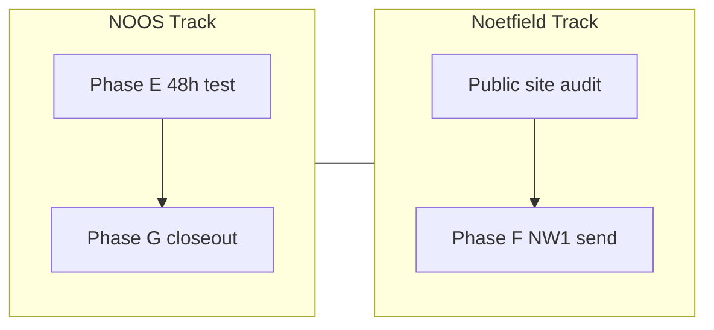

<!--
NOOS-AGENT-DOC
agent_id: noetfeld-os-cursor-chat
agent_lane: NOETFELD-OS
trace_id: NOOS-AGENT-20260706-033
doc_type: UNIFIED_NEXT_PLAN_LOCKED
workspace_root: /Users/sinakazemnezhad/Desktop/Noetfield-Systems/noetfeld-OS
lock_state: LOCKED_v1
authority: Founder review 2026-07-06 — supersedes ad-hoc next-action lists in ECOSYSTEM_NEXT_PLAN Phase C/E ordering
-->

# Unified Next Plan — NOOS + Noetfield v1

**Status:** LOCKED v1 (2026-07-06)  
**Supersedes:** partial ordering in `NOOS-AGENT-20260702-024` (commercial vs autonomy sequencing only — locked decisions DEC-001–005 remain)  
**Extends:** `NOOS-AGENT-20260705-029` (Living System 99-Plan Phases E–G)  
**Research input:** External public-site audit recommendation (deep-research-report 2026-07-06)

---

## Executive frame

Two tracks run **in parallel**, not in sequence:

| Track | Question | Success signal |
|-------|----------|----------------|
| **NOOS** | Does the machine stay alive with the laptop closed? | 48h receipt `ok=true`, CF→Railway motor green |
| **Noetfield** | Can a buyer understand, trust, and act on the public surface? | Audit P0 fixes shipped + ≥1 NW1 send receipt |

**Doctrine (unchanged):** Autonomy in execution; human sovereignty over architecture, claims, and sends.



---

## Current truth (2026-07-06)

| Surface | State |
|---------|--------|
| CF motor | `noos-loop-fleet-tick-v1` cron `*/5` → Railway |
| Railway executor | `noos-loop-runner-production.up.railway.app` — canonical |
| Fly loop executor | **DESTROYED** — do not re-enable |
| PR #29 | **MERGED** to main |
| PR #30 | Open — Railway canon + Phase E/F prep |
| Living System | UPG-LS-01–08 done; preflight ok; T0 baseline captured |
| ACG lane | `PUBLIC_PAGE_LIVE + PROSPECT_PACKET_READY` |
| NW1 send | **Founder-gated** (`FT-COMMERCIAL-SEND`) |
| Deadman Telegram | **OFF** until founder re-gates |

---

## Track A — NOOS (10 steps)

| # | Step | Owner | Done when |
|---|------|-------|-----------|
| A1 | Merge **PR #30** after CI green | machine + founder | main has Railway canon scripts |
| A2 | Founder **closes laptop** (T0) | founder | 48h clock starts |
| A3 | Machine runs 48h (CF cron + deadman) | machine | deadman receipts every 30m |
| A4 | Drive `stale_count → 0` before T0 if possible | machine | `make cloud-motor-e2e` no WARN |
| A5 | At **T+48h**: `make living-system-verify-48h` | founder | receipt `ok` true/false honest |
| A6 | `make loop-verify-all` + `make deadman-probe` | founder | core loops verified |
| A7 | Fill 48h retro doc | founder + machine | `[NOOS-AGENT-20260706-030]` signed |
| A8 | Phase G closeout receipt + manifest | machine | `noos-living-system-99-closeout-v1.json` `ok=true` |
| A9 | Set `noetfield-org/LOOP_STATE.json` `autonomous_mode: true` | machine | **only if** 48h receipt ok |
| A10 | Retire `lane/phase-b-deadman` after clean merge | machine | branch deleted |

**Entry commands:** `make cloud-motor-e2e` · `make living-system-baseline` · `make living-system-verify-48h`

---

## Track B — Noetfield commercial + public surface (10 steps)

| # | Step | Owner | Done when |
|---|------|-------|-----------|
| B1 | **Lock audit topic:** external public-site review (2–4 weeks) | machine | protocol in `UPG-NF-PUB-01` evidence |
| B2 | Route inventory + claim-evidence matrix | machine | spreadsheet + screenshots |
| B3 | First-30s comprehension + CTA flow test | machine | buyer journey map |
| B4 | Trust-signal audit (Trust Brief, Trust Ledger, disclaimers) | machine | claim-risk matrix ranked P0–P3 |
| B5 | Apply **P0 public-risk fixes only** (Small Fix Rule) | machine | broken links, contradictions, unsupported claims removed |
| B6 | **Founder:** first NW1 send (ACG slot 1) | founder | `~/.sina/nw1-outbound-send-receipt-v1.json` `sent` |
| B7 | Update `SERVICE_LANES.md` → `FIRST_OUTREACH_SENT` | machine | only after valid send receipt |
| B8 | Expand `data/noos-acg-outbound-queue-v1.json` to 25 slots | machine | founder_gated on all sends |
| B9 | Weekly commercial digest receipt | machine | `noos-acg-weekly-digest-*.json` |
| B10 | **Defer** Copilot governance deep-dive until B1–B5 complete | — | medium project gated on audit |

**Scope boundary (audit):** Browser-visible / public HTTP only. No backend probing. No inferring regulated status from copy. No founder-gated claim additions without sign-off.

**Entry commands:** `make acg-founder-send-prep` · `python3 scripts/noos_acg_founder_send_prep_v1.py --json`

---

## Unified priority stack (what wins when conflicts)

1. **Do not disable CF cron** or re-enable Fly during debugging  
2. **48h test honesty** — no pass cosmetics (Living System step 72)  
3. **Claims discipline** — audit before adding testimonials, pricing, certifications  
4. **Founder sends** — machine prepares; founder clicks  
5. **Small Fix Rule** — P0 public cleanup does not need a 99-step ceremony  

---

## Upgrade IDs (new)

| ID | Track | Title | Gate |
|----|-------|-------|------|
| UPG-LS-09 | NOOS | 48h laptop-closed test + retro | founder observe + sign |
| UPG-LS-10 | NOOS | Living System 99 closeout + merge | founder sign |
| UPG-NF-PUB-01 | Noetfield | External public-site audit sprint | machine_safe |
| UPG-NF-PUB-02 | Noetfield | P0 claim-risk fixes from audit | machine_safe (Small Fix Rule) |
| UPG-0001 | Noetfield | First NW1 / ACG send | **founder_gated** |

---

## Out of scope (this plan cycle)

- Unsupervised Evolution layer redesign  
- Re-deploy Fly loop executor  
- Auto-enable Deadman Telegram without founder gate  
- npm `@noetfield/gate` publish (still UPG-0167 / legal)  
- SOC 2 / Ed25519 **public** capability claims (ECOSYSTEM Phase E deferred)  
- 6-month Copilot governance market study (after B1–B5)

---

## Verification bundle (weekly)

```bash
# NOOS
make cloud-motor-e2e
make loop-verify-all
bash scripts/check_noos_live_sync_gate.sh

# Noetfield public
cd ~/Desktop/Noetfield/Noetfield-All-Documents/Noetfield && bash scripts/verify-static-www.sh
curl -fsS https://www.noetfield.com/services/agentic-cost-governance | head -5
python3 scripts/noos_acg_founder_send_prep_v1.py --json
```

---

## Next action (immediate)

| Who | Action |
|-----|--------|
| **Founder** | Merge PR #30 when green → close laptop 48h → optional NW1 send from phone |
| **Machine** | Start UPG-NF-PUB-01 route inventory + claim matrix (parallel to 48h) |
| **Both** | At T+48h: living-system verify + decide P0 site fixes before scaling outbound |

**Locked by:** noetfeld-os-cursor-chat · 2026-07-06
