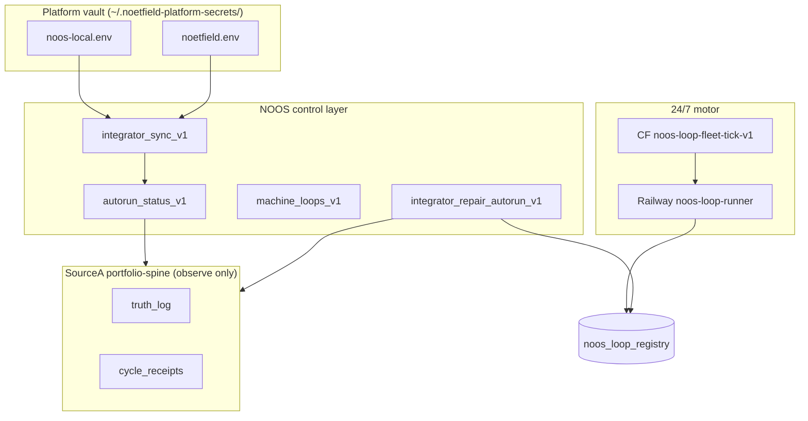

<!--
NOOS-AGENT-DOC
agent_id: noetfeld-os-cursor-chat
agent_lane: NOETFELD-OS
trace_id: NOOS-AGENT-20260707-007
doc_type: INTEGRATOR_CONTROL_PLAN
workspace_root: noetfeld-OS
-->

# NOOS Integrator Control Layer — Upgrade Plan v1

**Authority:** NOOS integrator (observe + coordinate). **Not** SourceA queue control — `phase_reconciler_v1` stays sole reconciler.

**Machine registry:** `data/noos-integrator-control-plan-v1.json`

---

## Executive snapshot (2026-07-07)

| Surface | State | Next action |
|--------|--------|-------------|
| CF loop motor | COMPLETE | sustain via */5 cron |
| GHA deploy workers | secrets synced | merge workflow fix → `deploy-noos-cloud-workers-v1` |
| Railway loop-runner | env synced | verify liveness writes after tick |
| Platform vault | `~/.noetfield-platform-secrets/` | edit `noos-local.env` for CF; `make cloud-secrets-sync` |
| Machine loops | chain_ok | continue outside-audit scan |
| Integrator mirror | clean | no drift |
| SourceA spine lanes | stale (6h) | `make integrator-repair-autorun` + sustain observe loop |
| Liveness registry | FAILED (stale loops) | repair + Railway upsert sustain |

---

## Architecture — three planes



**One law:** NOOS writes **desired-state receipts** and **heartbeat proxies** for dashboard freshness. SourceA cloud queue advancement stays on portfolio-spine writers + reconciler.

---

## Phase ICL-P0 — Control plane green (now)

### Done
- **ICL-P0-01** Platform vault separated from SourceA (`noos_vault_paths_v1.py`, `make cloud-vault-cleanup`)
- **ICL-P0-02** Agentic GHA + Railway sync (`make cloud-secrets-sync`)
- **ICL-P0-03** Cycle receipt probe filtering fix (`autorun_status_v1.py` — filter primary `cycle_receipts` by schema)

### In progress
- **ICL-P0-03b** `make integrator-repair-autorun` — liveness upsert + spine heartbeats
- **ICL-P0-04** Sustain liveness: Railway must keep writing `noos_loop_registry` each CF tick

### Acceptance (P0 close)
```bash
python3 scripts/autorun_status_v1.py | jq '.workflows[] | select(.status|test("BLOCKED|FAILED")) | {id,status,reason}'
# expect: empty or only founder-gated rows
python3 scripts/noos_loop_liveness_v1.py  # via seed — stale_count 0
make machine-audit  # chain_ok=True
```

---

## Phase ICL-P1 — Integrator automation ✅ DONE (2026-07-07)

| ID | Deliverable | Status |
|----|-------------|--------|
| ICL-P1-01 | `scripts/noos_local_boot_vault_sync_v1.sh` wired into `make local-boot` | done |
| ICL-P1-02 | `make cloud-workers-deploy` → GHA workflow | done |
| ICL-P1-03 | `observe_sourcea_supabase_v1.py` writes CRON_FIRED via `noos_portfolio_spine_heartbeat_v1.py` | done |
| ICL-P1-04 | Noetfield vault reads `~/.noetfield-platform-secrets/` first | done |

Receipt: `receipts/proof/noos-integrator-icl-p1-closeout-v1.json`

---

## Phase ICL-P1 — Integrator automation (reference)

| ID | Deliverable | Owner |
|----|-------------|-------|
| ICL-P1-01 | `local-boot` auto-runs vault promote + cloud sync when secrets change | machine |
| ICL-P1-02 | GHA `deploy-noos-cloud-workers-v1` on merge to main | machine |
| ICL-P1-03 | `noos_sourcea_observe_loop_tick` writes CRON_FIRED (replace one-shot repair) | machine |
| ICL-P1-04 | Noetfield repo reads `~/.noetfield-platform-secrets/` directly | machine |

---

## Phase ICL-P2 — Unified integrator dashboard (1 month)

| ID | Deliverable |
|----|-------------|
| ICL-P2-01 | `noos_integrator_status_v1.py` — vault + autorun + machine + conflicts one JSON |
| ICL-P2-02 | Optional Supabase `integrator_tasks` mirror (repo-local stays SSOT) |
| ICL-P2-03 | Cross-repo upgrade manifest publish (NOOS / Noetfield / contract surfaces only) |

---

## Founder gates (never block machine scan)

- **NOOS-C-01** — founder canon
- **UPG-NF-PUB-01** — public copy/IA (Track B verdict gate)
- **UPG-LS-09–10** — living system 48h closeout sign-off

---

## Operator commands

```bash
make local-boot
make cloud-vault-promote      # after editing ~/.sourcea-secrets/noetfield.env symlink
make cloud-secrets-sync       # GHA + Railway
make integrator-repair-autorun
python3 scripts/autorun_status_v1.py
make machine-audit
python3 scripts/noos_integrator_sync_v1.py summary --json
```

---

## Links

- Integrator protocol: `NOOS-AGENT-20260703-001`
- Unified backlog: `data/noos-unified-upgrade-backlog-v1.json`
- Autorun registry: `data/autorun-workflows-v1.json`
- Vault template: `config/noos-local.env.fill-me`
