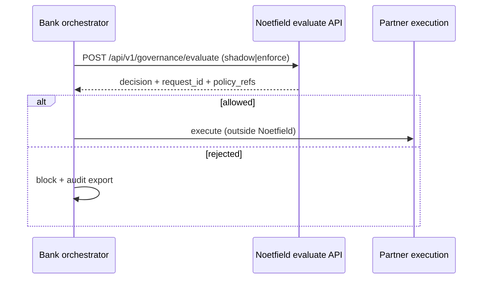

# Partner pre-execution integration (design)

## Pattern

Accredited integrators and bank PSPs call **Noetfield evaluate** before their own execution layer:



## Webhook: `governance.decision.recorded`

When `GOVERNANCE_WEBHOOK_URLS` is set, each evaluate emits:

```json
{
  "event": "governance.decision.recorded",
  "data": {
    "request_id": "RID-…",
    "correlation_id": "bank-run-123",
    "tenant_id": "…",
    "decision": "REJECT",
    "allowed": false,
    "reason_code": "…",
    "policy_refs": ["…"],
    "mode": "shadow"
  }
}
```

- **No PII** in the default payload.
- Optional **HMAC** via `GOVERNANCE_WEBHOOK_SECRET` → header `X-Noetfield-Signature: sha256=…`.

## SIEM / GRC

Map `reason_code` and `policy_refs` to ServiceNow, Archer, or Splunk using `request_id` as the correlation key shared with intake (`POST /api/intake`) and ops email.

## Enterprise tier (deferred in code)

- mTLS client certificates per tenant
- Per-tenant policy packs with Postgres RLS
- Signed webhook replay protection

Track engineering work in GitHub Issues (`engineering`), not public root trackers.
