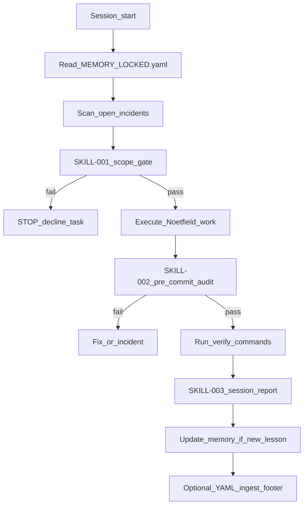

# Agent self-audit loop (LOCKED v1)

| Field | Value |
|-------|--------|
| Plane | `[DELIVERY]` — Noetfield cloud + local agents |
| Agent id | `noetfield_cloud` · `noetfield_local` |
| **Agent tag** | `NF-CLOUD-AGENT` |
| **Agent id** | `noetfield_cloud` |
| **Doc trace** | `NF-CLOUD-OPS-001` |
| **Updated** | 2026-06-06 |
| Status | LOCKED — update only via incident + memory bump |

---

## Purpose

Stop repeated agent mistakes (scope bleed, wrong company, wrong repo) through a **mandatory loop**: read memory → gate scope → work → verify → report → update memory/incidents.

**This repo = Noetfield only.** TrustField and VIRLUX are separate companies — never implement, plan, or deploy for them here.

### Industry parallel (eval → enforce closed loop)

Noetfield audit iterations mirror the June 2026 Open Trust Stack pattern without vendoring external packages:

| Layer | Industry analog | Noetfield implementation |
|-------|-----------------|--------------------------|
| Eval | ASSERT (policy → executable tests) | `./scripts/plan-with-no-asf-verify.sh` — finds defects before ship |
| Enforce | ACS / AGT (fail-closed runtime controls) | FAIL gates in `verify-no-asf-coherence.sh` and `verify-gtm-ops-docs.sh` |
| Re-eval | Closed loop | Repeated audit iterations (GTM_NEXT ship bundles) until verify PASS |

Buyer-facing framework authority: [GOVERNANCE_SOURCES_BOOK_v1.md](../reference/GOVERNANCE_SOURCES_BOOK_v1.md) (NIST AI RMF, ISO/IEC 42001).

---

## Loop diagram



---

## Phase 0 — Session start (before any edit)

1. Read [.cursor/agent-memory/MEMORY_LOCKED.yaml](../../.cursor/agent-memory/MEMORY_LOCKED.yaml)
2. Read [.cursor/incidents/REGISTRY.md](../../.cursor/incidents/REGISTRY.md) — **open** incidents
3. Read [PROJECT_BOUNDARIES_LOCKED.md](../../PROJECT_BOUNDARIES_LOCKED.md)
4. Run scope gate skill: [.cursor/skills/SKILL-001-scope-gate-before-work.md](../../.cursor/skills/SKILL-001-scope-gate-before-work.md)

Also at session start (cloud agents):

5. Apply **R-011** — [.cursor/skills/SKILL-008-agentic-commercial-boundary.md](../../.cursor/skills/SKILL-008-agentic-commercial-boundary.md)
6. Read [FOUNDER_AGENTIC_COMMERCIAL_AND_NO_CURSOR_AUTORUN_LOCKED_v1.md](./FOUNDER_AGENTIC_COMMERCIAL_AND_NO_CURSOR_AUTORUN_LOCKED_v1.md)
7. Queue source when registry 1000/1000: [plans/no-asf/GTM_NEXT.md](./plans/no-asf/GTM_NEXT.md) — outreach execution = agentic Hub only

**cursor-reply format (iter 13+):** [reports/cursor-reply-latest.txt](../../reports/cursor-reply-latest.txt) must include `main: <short-sha>` (merge base) and on feature branches `head: <short-sha>` citing the **ship commit** (parent of the closeout-only reply commit). Coherence verify FAILs on drift.

**If task mentions TrustField, trustfield.ca, VIRLUX, UPG for TrustField, or MSB vendor pack on TrustField www → STOP.** Reply: *"That is not Noetfield scope. I only work on noetfield.com / this repo."*

---

## Doc tagging

Every agent-written doc: [AGENT_DOC_TAGGING_LOCKED_v1.md](./AGENT_DOC_TAGGING_LOCKED_v1.md) + [SKILL-005](../../.cursor/skills/SKILL-005-doc-tagging.md).

---

## Phase 1 — During work

| Check | Rule |
|-------|------|
| Repo | Changes only in Noetfield product, www, governance-console, scripts, docs/ops |
| Domains | `noetfield.com` — not `trustfield.ca` |
| Issues | `NF-*` labels — not `TF-*` or `VL-*` |
| Private | Never commit `ops/private/`, `docs/internal/` |
| Research | Internal fintech notes are **not** a mandate to implement TrustField www |

---

## Phase 2 — Pre-commit audit (mandatory)

1. Run: `./scripts/verify-agent-scope.sh`
2. Apply: [.cursor/skills/SKILL-002-pre-commit-audit.md](../../.cursor/skills/SKILL-002-pre-commit-audit.md)
3. If scope script FAIL → do not commit; file incident if boundary was crossed

---

## Phase 3 — Session end report

Fill [.cursor/reports/SESSION_REPORT_TEMPLATE.md](../../.cursor/reports/SESSION_REPORT_TEMPLATE.md) (copy to dated file or paste in reply).

Required fields:

- `task_summary`
- `scope_confirmed: noetfield_only`
- `verify_commands_run`
- `incidents_opened_or_closed`
- `memory_lessons_added`
- `mistakes_avoided` (explicit list)

Optional ingest footer: [EXECUTION_TRUTH_AGENT_REPLY_LOCKED.md](../spec/EXECUTION_TRUTH_AGENT_REPLY_LOCKED.md)

---

## Phase 4 — When a mistake happens

1. **Stop** further work on the wrong scope immediately
2. File incident: [.cursor/skills/SKILL-004-incident-when-boundary-crossed.md](../../.cursor/skills/SKILL-004-incident-when-boundary-crossed.md)
3. Add lesson to `MEMORY_LOCKED.yaml`
4. Add preventive rule to `.cursor/rules/` if gap found
5. Run `verify-agent-scope.sh` on branch before next commit

---

## File map

| Asset | Path |
|-------|------|
| Memory | [.cursor/agent-memory/MEMORY_LOCKED.yaml](../../.cursor/agent-memory/MEMORY_LOCKED.yaml) |
| Incidents | [.cursor/incidents/](../../.cursor/incidents/) |
| Skills | [.cursor/skills/](../../.cursor/skills/) |
| Session reports | [.cursor/reports/](../../.cursor/reports/) |
| Scope verify | [scripts/verify-agent-scope.sh](../../scripts/verify-agent-scope.sh) |
| Boundaries | [PROJECT_BOUNDARIES_LOCKED.md](../../PROJECT_BOUNDARIES_LOCKED.md) |

---

## Verification

```bash
./scripts/verify-agent-scope.sh
test -f docs/ops/AGENT_SELF_AUDIT_LOOP_LOCKED_v1.md
test -f .cursor/agent-memory/MEMORY_LOCKED.yaml
```

---

**END**
