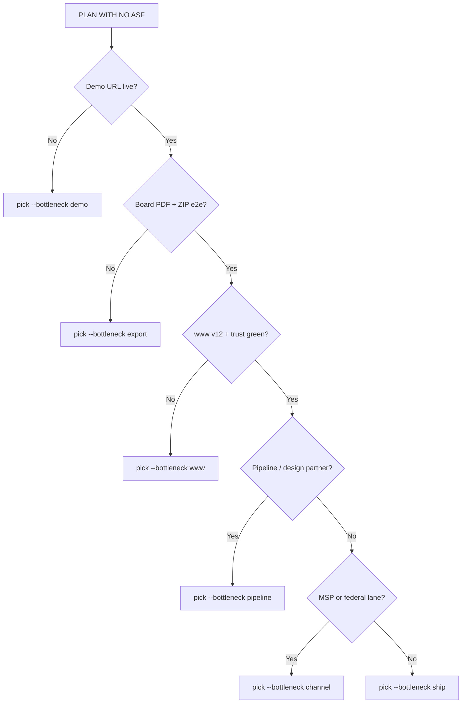

# Noetfield Prompt Pack — v13 SMART (LOCKED v1)

| Field | Value |
|-------|--------|
| **Status** | **SUPERSEDED for execution** — use [NOETFIELD_PROMPT_PACK_V14_WISE_LOCKED_v1.md](./NOETFIELD_PROMPT_PACK_V14_WISE_LOCKED_v1.md) · `make pick-wise` (`pick-tier1-smart` is alias only) |
| **Machine SSOT** | [tier1-smart.json](./plans/tier1-smart.json) · [tier1-status.json](./plans/tier1-status.json) |
| **Human prompts** | [TIER1_SMART_PROMPTS.md](./plans/TIER1_SMART_PROMPTS.md) (generated) |
| **Picker (legacy)** | `python3 scripts/pick-wise.py` — prefer over `pick-tier1-smart.py` |
| **Regenerate** | `python3 scripts/generate-tier1-smart-pack.py` |

---

## 1. What “SMART” means here

| Letter | Rule | Agent behavior |
|--------|------|----------------|
| **S** — State-aware | Read `tier1-status.json` + W3 bottleneck | Never pick blocked deps; prefer export/demo chain |
| **M** — Minimal context | Max **5 files** in context budget | Do not read legacy 1000-grid or Prompt OS stage chains |
| **A** — Action-bounded | One artifact · one verify · ≤3 tasks/session | Stop at done_when — no drive-by refactors |
| **R** — Reversible | Generator-first www · no secrets in repo | If stop_if triggers → ask founder, do not improvise |
| **T** — Testable | Every prompt has bash verify + observable done_when | No “looks good” closeout without command output |

---

## 2. W3 dispatcher (founder / agent — pick bottleneck first)



**CLI examples:**

```bash
python3 scripts/pick-tier1-smart.py --bottleneck export --limit 3 --prompt
python3 scripts/pick-tier1-smart.py --id E-05 --prompt
python3 scripts/sync-tier1-status.py --done E-01 E-05
```

---

## 3. Tier architecture (unchanged counts, smarter execution)

| Tier | Count | Pick? | Notes |
|------|-------|-------|-------|
| **T0** Constitution | 12 | Manual | Worker V3 · PLAN WITH NO ASF · scope gates |
| **T1** SMART active | 50 | **Yes** | JSON + dependency graph |
| **T2** Product backlog | ~150 | After W3 | Pilot-gated from NF-PLAN registry |
| **T3** Archive | ~800 | Never | Grid duplicates frozen |

---

## 4. W3 signal map (what each prompt moves)

| Signal | W3 / commercial meaning | Primary prompts |
|--------|-------------------------|-----------------|
| `demo_live` | Week 0–2: demo URL for CIO | E-01, P-05 |
| `export_e2e` | **Board PDF in meeting** bar | E-05, E-06, E-04 |
| `www_proof` | Receipt-first public story | L-02, L-11, E-15 |
| `trust_diligence` | Procurement self-serve | L-03, L-04, E-19 |
| `intake_conversion` | Trust Brief / gate RID | L-01, L-08, L-14 |
| `design_partner` | LOI / deposit path | L-05, L-15, E-11, E-20 |
| `channel_attach` | MSP / federal Phase 2 | L-09, L-10, H-* |
| `tle_artifact` | Credible TLE samples + verify | E-02, E-03, E-12 |
| `workspace_path` | Evaluate → export product loop | E-07, E-08, E-10 |
| `ship_green` | verify-gtm / e2e after change | P-01, P-02, P-03 |

---

## 5. Dependency-critical path (always prefer when unblocked)

```
L-11 → E-01 → E-04 → E-05 + E-06  (W3 proof spine)
L-02 → L-03 → L-04                 (diligence spine)
L-02 → P-01                        (www smoke spine)
```

**Default chain when no bottleneck specified:** E-01 → E-05 → E-06 → L-02 → P-01

---

## 6. Persona lenses (same task, different buyer proof)

When `--persona` set, picker filters Tier 1:

| Persona | Use when | Example ids |
|---------|----------|-------------|
| **CISO** | Demo / pilot / enterprise | E-01, E-11, L-13 |
| **GRC** | TLE + board + federal | E-02, E-05, L-09 |
| **Procurement** | Trust + ZIP + NIST | L-03, L-04, H-05 |
| **CIO** | M365 + CCS complement | L-11, E-08, L-07 |
| **MSP** | Channel Phase 2 | L-10, H-01, H-10 |
| **Investor** | Honest scarcity | L-05, L-06 |
| **Founder** | Hub agentic only | L-15, E-20, H-10 |
| **Ops** | Ship gates | P-01, P-03, L-08 |

---

## 7. Anti-patterns (instant reject)

1. Picking from NF-PLAN grid when Tier 1 backlog exists  
2. NF-CLOUD executing `agent_mode: hub` (outreach, calls, send)  
3. Reading >5 context files “for thoroughness”  
4. Fixing demo by adding fake exports or cert rows  
5. Marking Tier 1 done without verify command in closeout  
6. Parallel >3 Tier 1 ids in one session  

---

## 8. Tier 0 constitution (unchanged — use with SMART)

See v12 §6 — C-01…C-12. **Always prepend C-02 Worker V3** when agent is cold-start.

---

## 9. Tier 2 backlog gates (smart gating)

| Gate | Condition to unlock Tier 2 pick |
|------|----------------------------------|
| **B** | First design partner SOW signed |
| **C** | 3+ customers OR board PDF proven in meeting |
| **Platform** | W3 PASS + founder `implement` |

Tier 2 rows stay in `registry.json` with `tier_active: 2` — never mixed into Tier 1 picker.

---

## 10. Legacy pack relationship

| Asset | v13 treatment |
|-------|---------------|
| NF-PLAN 1000 grid | Archive; superseded_by Tier 1 id where mapped |
| noetfield-1000 library | Ops/hygiene only; GTM defers to Tier 1 SMART |
| GTM_PRIORITY_100 | Folded into Tier 1 agentic fence (L-15, E-20) |
| Prompt OS stage1–3 | Frozen — L0-law ingest only |

---

## 11. Session workflow (PLAN WITH NO ASF + SMART)

1. `python3 scripts/pick-tier1-smart.py --bottleneck <hint> --limit 3 --prompt`  
2. Founder approves **≤1** id (prefer 1 over 3 for L-effort)  
3. Agent executes with context budget only  
4. Run verify from prompt block  
5. `python3 scripts/sync-tier1-status.py --done <id>`  
6. `make verify-gtm` or plan-with-no-asf-verify  
7. cursor-reply-latest.txt closeout  

---

## 12. Implementation status

- [x] `generate-tier1-smart-pack.py` — 50 prompts with deps + SMART blocks  
- [x] `pick-tier1-smart.py` — W3-weighted picker  
- [x] `sync-tier1-status.py` — done/backlog tracking  
- [x] `TIER1_SMART_PROMPTS.md` — generated copy-paste  
- [ ] Wire `make pick-tier1-smart` in Makefile  
- [ ] Map NF-PLAN ids → Tier 1 superseded_by in registry batch script  

---

**Related:** [TIER1_W3_ACTIVE_50.md](./plans/TIER1_W3_ACTIVE_50.md) (index table) · [WWW_V12_MASTER_PLAN_LOCKED_v1.md](../WWW_V12_MASTER_PLAN_LOCKED_v1.md)
