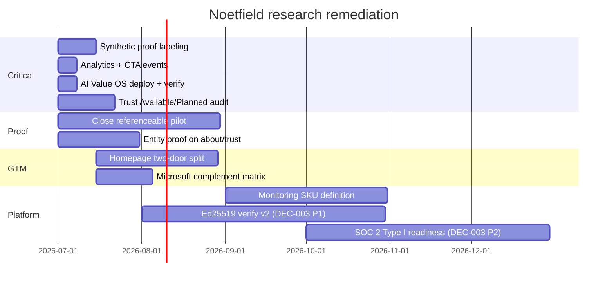

# Noetfield Research Remediation — Execution Tracker v1

## Purpose

Turn the external **Noetfield.com Research Report** (July 2026) into a tracked execution plan across:

1. **NOOS lane** — governance runtime, trust receipts, control docs, enforcement
2. **Website lane** — `noetfield.com` public surface remediation with **file-level tasks per page**

This doc is the **single tracker**. Website edits execute in the website repo; NOOS edits execute in `noetfeld-os`. Do not self-certify PASS on public claims without external D4 verification where doctrine requires it.

## Researcher verdict (baseline)

| Theme | Assessment |
|-------|------------|
| Product packaging | Strong — artifact-centric (TLE, Board PDF, Procurement ZIP, verify) |
| Honest scope | Strength — anti-inflation, not-a-certifier language |
| Traction proof | Weak — pre-scale; synthetic proof; no public logos/revenue/users |
| GTM clarity | Split — SME Intelligence vs enterprise governance on same shell |
| Competitive risk | Microsoft native + broad AI-governance suites |
| Trust posture | Mixed — verify live; SOC 2 / Ed25519 / SIEM webhooks planned |
| Key proof threshold | **One contracted org using Board PDF in real governance meeting** |

## Status legend

| Status | Meaning |
|--------|---------|
| `pending` | Not started |
| `in_progress` | Active lane work |
| `blocked` | Waiting on founder/commercial/external verifier |
| `done` | Completed and receipted |
| `wontfix` | Explicitly deferred with reason |

## Priority stack (do first)

| Order | Track ID | Issue | Horizon |
|-------|----------|-------|---------|
| 1 | TRK-001 | Close referenceable pilot + Board PDF proof | 0–90d |
| 2 | TRK-002 | Synthetic vs live proof labeling | 0–14d |
| 3 | TRK-003 | Dual GTM homepage/nav clarity | 30–45d |
| 4 | TRK-007 | Trust Available/Planned audit | 0–21d |
| 5 | TRK-010 | Entity proof on primary site | 0–30d |
| 6 | TRK-014 | Analytics + CTA event baseline | 0–7d |
| 7 | TRK-005 | Microsoft complement matrix | 0–21d |
| 8 | TRK-008 | AI Value OS wedge (deploy + measure) | 0–7d |

---

## Master track register

### TRK-001 — Public traction proof

**Researcher issue:** No logos, user counts, revenue, funding, or independent reviews. First win is a **target**, not published outcome.

| Step | Action | Owner | Status | Receipt |
|------|--------|-------|--------|---------|
| 1.1 | **LOCKED (DEC-002):** First proof lane = Trust Brief / AI Value OS — not Copilot Pack or Bank shadow | Commercial | done | DEC-002 |
| 1.2 | Contract pilot with explicit success: TLE in prod + Board PDF in governance forum | Commercial | pending | SOW |
| 1.3 | Capture permissioned/redacted artifacts for publish | Commercial + Legal | pending | — |
| 1.4 | Update investor + trust pages from "target" → "achieved" when true | Website | pending | deploy receipt |
| 1.5 | Publish aggregate metrics only if defensible (sandbox evaluates, pilot count band) | Website + Ops | pending | — |

**Success metric:** 1 permissioned reference or anonymized live case; Board PDF used in real meeting.

**NOOS tasks:** Ensure TLE export + evaluate reliability for pilot tenant.

---

### TRK-002 — Synthetic proof case labeling

**Researcher issue:** Flagship proof is **synthetic Northstar** — useful for orientation, not customer validation.

| Step | Action | Owner | Status | Receipt |
|------|--------|-------|--------|---------|
| 2.1 | Audit all Northstar/synthetic references sitewide | Website | pending | grep inventory |
| 2.2 | Add persistent **Synthetic orientation — not a customer** label where missing | Website | pending | PR |
| 2.3 | Create **Live proof** section on trust/proof pages (empty until TRK-001) | Website | pending | PR |
| 2.4 | Chatbot knowledge: never imply Northstar is a client | Website | pending | MANIFEST row |

**Success metric:** Zero pages where synthetic reads as customer reference.

---

### TRK-003 — Dual GTM clarity (SME vs enterprise)

**Researcher issue:** Homepage mixes Canadian SME Intelligence with enterprise Copilot governance.

| Step | Action | Owner | Status | Receipt |
|------|--------|-------|--------|---------|
| 3.1 | **LOCKED (DEC-001):** Homepage = two-door entry (Enterprise governance vs SME Intelligence) | Founder | done | DEC-001 |
| 3.2 | Implement two-door split on homepage + nav | Website | pending | PR |
| 3.3 | Pricing: two-column Governance SKUs vs Intelligence SKUs | Website | pending | PR |
| 3.4 | Chatbot intent split: SME vs enterprise | Website | pending | knowledge files |
| 3.5 | **LOCKED (DEC-005):** Build minimal `/intelligence/` hub; register in ROUTE_INVENTORY | Website | pending | PR + route entry |

**Locked GTM:** Two-door homepage; enterprise door leads to **AI Value Governance OS** (DEC-004); SME door leads to Intelligence lane.

**Success metric:** Enterprise inbound describes offer without SME confusion.

---

### TRK-004 — Services-led → platform expand

**Researcher issue:** Services-led today; margin/speed limited until recurring monitoring revenue.

| Step | Action | Owner | Status | Receipt |
|------|--------|-------|--------|---------|
| 4.1 | Keep three locked SKUs discipline | Commercial | in_progress | existing pages |
| 4.2 | Define **Governance Ops Monitor** recurring SKU (distinct from SME AI Ops) | Commercial + Product | pending | SKU doc |
| 4.3 | Every paid engagement → TLE habit + export + expansion hook | Delivery | pending | SOW template |
| 4.4 | MSP/federal channel playbook refresh | Commercial | pending | partner doc |

**Success metric:** ≥1 pilot converts to 6+ month retainer or monitoring SKU.

---

### TRK-005 — Microsoft incumbent response

**Researcher issue:** Microsoft Copilot Control System covers native surface; Noetfield must own receipt/export/evidence layer.

| Step | Action | Owner | Status | Receipt |
|------|--------|-------|--------|---------|
| 5.1 | Add complement matrix (Microsoft native vs Noetfield overlay) | Website | pending | PR |
| 5.2 | Objection handler in sales gate / copilot pages | Website | pending | PR |
| 5.3 | Quarterly Microsoft feature parity review | Product | pending | ops note |

**Success metric:** Complement positioning on all Copilot-facing pages.

---

### TRK-006 — Broad AI-governance suite competition

**Researcher issue:** Credo, Holistic, ServiceNow, Monitaur cover broader portfolio governance.

| Step | Action | Owner | Status | Receipt |
|------|--------|-------|--------|---------|
| 6.1 | Internal battlecards (overlay vs suite) | Commercial | pending | internal doc |
| 6.2 | Public "When Noetfield fits" page (honest, no trash-talk) | Website | pending | new page or section |
| 6.3 | Position SIEM/GRC webhooks as integration, not replacement | Product + Website | pending | trust page |

**Success metric:** ≥1 deal positioned as overlay to existing GRC stack.

---

### TRK-007 — Trust posture gap (SOC 2, crypto, webhooks)

**Researcher issue:** SOC 2 Type II, Ed25519/Merkle, SIEM/GRC webhooks are **planned** — buyers may want sooner.

| Step | Action | Owner | Status | Receipt |
|------|--------|-------|--------|---------|
| 7.1 | Sitewide audit: every security claim has Available/Planned/Out-of-scope badge | Website | pending | audit checklist |
| 7.2 | Fail-closed verify regression + uptime monitor | NOOS + Ops | pending | gate receipt |
| 7.3 | **LOCKED (DEC-003):** Ed25519 verify v2 spec + trust page date — **first** trust roadmap priority | NOOS | pending | doc + code |
| 7.4 | **LOCKED (DEC-003):** SOC 2 Type I readiness → Type II timeline — **second**, after Ed25519 | Ops | pending | trust page |
| 7.5 | One webhook pilot integration | NOOS | pending | API doc |
| 7.6 | Procurement security appendix template | Commercial | pending | gate/procurement |

**Success metric:** Zero unlabeled trust claims; Ed25519 or SOC 2 Type I milestone dated.

---

### TRK-008 — M365 concentration + AI Value OS wedge

**Researcher issue:** Heavy Copilot anchor; exposed if Microsoft closes evidence gap.

**Locked enterprise lead (DEC-004):** AI Value Governance OS is the primary enterprise wedge; Copilot Pack remains attach lane.

| Step | Action | Owner | Status | Receipt |
|------|--------|-------|--------|---------|
| 8.1 | `/ai-value-governance-os/` contract page live | Website | done | commit `9a24de09` |
| 8.2 | Deploy to production + live nerve verify | Website + Ops | pending | verify receipt |
| 8.3 | Briefing CTA analytics event | Website | pending | TRK-014 |
| 8.4 | Quarterly Microsoft parity review trigger | Product | pending | — |

**Success metric:** ≥2 active revenue lanes; AI Value OS briefing measurable.

---

### TRK-009 — Procurement friction

**Researcher issue:** Thin external validation increases procurement friction.

| Step | Action | Owner | Status | Receipt |
|------|--------|-------|--------|---------|
| 9.1 | Standard Procurement ZIP contents checklist (public) | Website | pending | PR |
| 9.2 | Entity docs + DPA + subprocessors list | Ops + Website | pending | gate/procurement |
| 9.3 | Security questionnaire response template | Ops | pending | internal |
| 9.4 | Trust Brief as procurement unlock before production tenant | Commercial | in_progress | existing funnel |

**Success metric:** Security questionnaire turnaround < 5 business days.

---

### TRK-010 — Corporate / registry public proof

**Researcher issue:** BC incorporation cited; registry not verified on primary Noetfield surface.

| Step | Action | Owner | Status | Receipt |
|------|--------|-------|--------|---------|
| 10.1 | Obtain BC registry extract | Ops | pending | internal |
| 10.2 | Publish legal name, jurisdiction, incorporation # on `/about/` or `/trust/` | Website | pending | PR |
| 10.3 | Remove SourceA-only dependency for incorporation facts | Website | pending | PR |
| 10.4 | Align footer, enterprise, investor, procurement docs | Website | pending | PR |

**Success metric:** Incorporation verifiable from noetfield.com primary pages.

---

### TRK-011 — Team visibility

**Researcher issue:** Only founder publicly identified; team unspecified.

| Step | Action | Owner | Status | Receipt |
|------|--------|-------|--------|---------|
| 11.1 | Expand `/about/` with roles/functions (no fake headcount) | Website | pending | PR |
| 11.2 | LinkedIn company page alignment + link from site | Marketing | pending | — |
| 11.3 | Named advisors only if real and permissioned | Founder | pending | — |

**Success metric:** About page answers "who builds this?" without stealth gap.

---

### TRK-012 — Stack / hosting transparency

**Researcher issue:** Hosting, runtime, frontend, DB, analytics unspecified publicly.

| Step | Action | Owner | Status | Receipt |
|------|--------|-------|--------|---------|
| 12.1 | Public architecture summary on `/gel/` or `/trust/` | Website + NOOS | pending | PR |
| 12.2 | Disclose hosting at high level (true providers only) | Website | pending | PR |
| 12.3 | Maintain PRODUCT_TRUTH in NOOS; no SourceA stack mixing | NOOS | in_progress | existing rule |

**Success metric:** Security reviewers can answer "where does evaluate run?" from public docs.

---

### TRK-013 — SourceA / TrustField brand bleed

**Researcher issue:** Same legal entity discloses sibling products; risks buyer confusion.

| Step | Action | Owner | Status | Receipt |
|------|--------|-------|--------|---------|
| 13.1 | Enterprise buyer path never requires SourceA understanding | Website | in_progress | AI Value OS footnote |
| 13.2 | Investor page: one paragraph max on corporate structure | Website | pending | PR |
| 13.3 | Maintain conflict matrix doc | NOOS | pending | docs/spec |

**Success metric:** Zero SourceA product claims on enterprise procurement path.

---

### TRK-014 — Funnel / traffic baseline

**Researcher issue:** No reliable public traffic data; funnel unmeasured.

| Step | Action | Owner | Status | Receipt |
|------|--------|-------|--------|---------|
| 14.1 | Deploy privacy-respecting analytics on noetfield.com | Website + Ops | pending | config |
| 14.2 | Event goals: sandbox, trust-brief intake, pilot apply, AI Value briefing, verify | Website | pending | — |
| 14.3 | 30-day baseline report | Ops | pending | internal |

**Success metric:** All primary CTAs instrumented within 7 days.

---

### TRK-015 — Social / thought leadership

**Researcher issue:** Very limited LinkedIn footprint; playbook content exists.

| Step | Action | Owner | Status | Receipt |
|------|--------|-------|--------|---------|
| 15.1 | 2 posts/month: artifact education (TLE, Board PDF) | Marketing | pending | — |
| 15.2 | Refresh playbook vendor-diligence with date | Website | pending | PR |
| 15.3 | Co-marketing only with signed MSP partners | Commercial | pending | — |

**Success metric:** Inbound citing playbook or sample Board PDF.

---

### TRK-016 — Wedge must convert to paid

**Researcher issue:** Must prove buyers pay for evidence layer, not just admire demos.

| Step | Action | Owner | Status | Receipt |
|------|--------|-------|--------|---------|
| 16.1 | Win/loss tagging: "Microsoft sufficient" vs "needed evidence layer" | Commercial | pending | CRM |
| 16.2 | Sandbox → intake conversion review (weekly) | Commercial + Ops | pending | TRK-014 |
| 16.3 | First contracted Governance Pack closes TRK-001 | Commercial | pending | SOW |

**Success metric:** 1 paid institutional SKU closed with reference path.

---

## Website remediation checklist — file-level tasks

**Repo:** `Noetfield/` (website)  
**Verify after each batch:** `python3 scripts/verify-route-inventory.py && bash scripts/verify-static-www.sh`

### Tier 0 — Critical proof & honesty (TRK-001, TRK-002, TRK-016)

| File | Route | Task | Track | Status |
|------|-------|------|-------|--------|
| `copilot/proof-case/index.html` | `/copilot/proof-case/` | Confirm synthetic label visible above fold; add link to future live-proof section | TRK-002 | pending |
| `copilot/demo/index.html` | `/copilot/demo/` | Audit demo copy for implied customer references | TRK-002 | pending |
| `investors/index.html` | `/investors/` | Update first-win line when TRK-001 closes; keep anti-ARR/logo language | TRK-001 | pending |
| `trust/index.html` | `/trust/` | Add **Live proof** section placeholder + proof tier legend | TRK-001, TRK-002 | pending |
| `trust-ledger/sample-report/index.html` | `/trust-ledger/sample-report/` | Label sample Board PDF as official sample, not customer output | TRK-002 | pending |

### Tier 1 — GTM clarity (TRK-003)

| File | Route | Task | Track | Status |
|------|-------|------|-------|--------|
| `index.html` | `/` | **DEC-001:** Two-door hero — Enterprise (AI Value OS) vs SME Intelligence | TRK-003 | pending |
| `assets/partials/header.html` | (global) | Confirm enterprise path → `/ai-value-governance-os/`; SME paths distinct | TRK-003 | done |
| `pricing/index.html` | `/pricing/` | Split Governance SKUs vs Intelligence SKUs in two columns | TRK-003 | pending |
| `intelligence/intake/index.html` | `/intelligence/intake/` | Ensure SME lane CTA does not lead with Board PDF procurement | TRK-003 | pending |
| `governance/ROUTE_INVENTORY.json` | — | **DEC-005:** Add `/intelligence/` route → minimal hub page | TRK-003 | pending |
| `intelligence/index.html` | `/intelligence/` | **DEC-005:** Build minimal Intelligence hub (SME lane entry, links to intake) | TRK-003 | pending |
| `data/chatbot/knowledge/*.md` | — | Split SME vs enterprise intents; no mixed answers | TRK-003 | pending |
| `data/chatbot/MANIFEST.json` | — | Register new/updated knowledge rows after split | TRK-003 | pending |

### Tier 2 — Enterprise positioning & Microsoft complement (TRK-005, TRK-006, TRK-008)

| File | Route | Task | Track | Status |
|------|-------|------|-------|--------|
| `ai-value-governance-os/index.html` | `/ai-value-governance-os/` | Deploy live; verify briefing CTA + honest scope callout | TRK-008 | done (local) |
| `copilot/index.html` | `/copilot/` | Add Microsoft complement matrix section | TRK-005 | pending |
| `copilot/pilot/index.html` | `/copilot/pilot/` | Add objection handler: "We already have Purview" | TRK-005 | pending |
| `governance/index.html` | `/governance/` | Add complement matrix + link to AI Value OS | TRK-005, TRK-008 | pending |
| `enterprise/index.html` | `/enterprise/` | Align with AI Value OS positioning; dedupe stale copy | TRK-008 | pending |
| `federal/index.html` | `/federal/` | Confirm not-a-certifier language; AIA/ADM mapping current | TRK-006 | pending |
| `bank-pilot/index.html` | `/bank-pilot/` | Confirm read-only shadow scope; no custody claims | TRK-006 | pending |
| `investors/diligence/index.html` | `/investors/diligence/` | Verify pricing CAD 15k–35k matches research; no fake logos | TRK-006 | pending |
| `next/index.html` | `/next/` | Buyer lane segmentation clarity (procurement, legal, board) | TRK-005 | pending |

### Tier 3 — Trust & procurement (TRK-007, TRK-009, TRK-010, TRK-012)

| File | Route | Task | Track | Status |
|------|-------|------|-------|--------|
| `trust/index.html` | `/trust/` | Full Available/Planned/Out-of-scope audit | TRK-007 | pending |
| `trust-ledger/verify/index.html` | `/trust-ledger/verify/` | Keep planned crypto disclaimer; regression test verify flow | TRK-007 | pending |
| `index.html` | `/` | Audit moat grid badges — all Planned items labeled | TRK-007 | pending |
| `gel/index.html` | `/gel/` | Add public architecture summary (API, hosting high-level) | TRK-012 | pending |
| `about/index.html` | `/about/` | Add Noetfield Systems Inc. entity proof (BC incorporation) | TRK-010 | pending |
| `gate/procurement/index.html` | `/gate/procurement/` | Publish Procurement ZIP checklist | TRK-009 | pending |
| `gate/procurement/procurement-pack/index.html` | — | Align pack contents with public checklist | TRK-009 | pending |
| `gate/procurement/security-privacy-summary/index.html` | — | Honest security appendix; planned vs live | TRK-007, TRK-009 | pending |
| `copilot/procurement/index.html` | `/copilot/procurement/` | Cross-link standard procurement pack | TRK-009 | pending |
| `playbook/vendor-due-diligence/index.html` | `/playbook/vendor-due-diligence/` | Refresh date; link from trust center | TRK-009, TRK-015 | pending |
| `privacy/index.html` | `/privacy/` | Subprocessors + data flow alignment with metadata-only M365 | TRK-009 | pending |

### Tier 4 — Funnel, intake & analytics (TRK-014, TRK-016)

| File | Route | Task | Track | Status |
|------|-------|------|-------|--------|
| `start/index.html` | `/start/` | Instrument sandbox start event | TRK-014 | pending |
| `trust-brief/intake/index.html` | `/trust-brief/intake/` | Instrument by `vector` param; add hero for `ai-value-governance-os` | TRK-008, TRK-014 | pending |
| `contact/index.html` | `/contact/` | Confirm `enterprise-governance` topic + URL prefill | TRK-008 | done |
| `assets/noetfield-forms.js` | — | Verify topic prefill + intake vector logging | TRK-014 | pending |
| www routing or analytics config | — | Add analytics script (Plausible/Fathom/GA4 — pick one) | TRK-014 | pending |

### Tier 5 — Brand separation & about (TRK-011, TRK-013)

| File | Route | Task | Track | Status |
|------|-------|------|-------|--------|
| `about/index.html` | `/about/` | Team/functions section; founder + delivery roles | TRK-011 | pending |
| `investors/index.html` | `/investors/` | One paragraph corporate structure; no SourceA product mixing | TRK-013 | pending |
| `work-with-us/index.html` | `/work-with-us/` | Partner vs enterprise buyer clarity | TRK-013 | pending |
| `msp/index.html` | `/msp/` | Channel positioning: MSP readiness + Noetfield receipt layer | TRK-004 | pending |

### Tier 6 — Already aligned (audit only)

| File | Route | Notes | Status |
|------|-------|-------|--------|
| `index.html` | `/` | Has "Do not claim: Platform ARR · logo wall" callout | audit |
| `governance/index.html` | `/governance/` | Available/Planned badges present | audit |
| `copilot/pilot/index.html` | `/copilot/pilot/` | Honest scope callout for Ed25519 | audit |
| `ai-value-governance-os/index.html` | `/ai-value-governance-os/` | R&D footnote; no SourceA mixing | audit |

---

## NOOS lane checklist (non-website)

| Task | Track | Status | Notes |
|------|-------|--------|-------|
| TLE export reliability for pilot tenant | TRK-001 | pending | `noetfeld-os` runtime |
| Evaluate API uptime + health gate | TRK-007 | pending | `api.noetfield.com` |
| Ed25519 verify v2 specification | TRK-007 | pending | **DEC-003 priority 1** |
| SOC 2 Type I readiness | TRK-007 | pending | **DEC-003 priority 2** |
| SIEM/GRC webhook pilot | TRK-007 | pending | one integration |
| Doctrine IV enforcement shim | control scope | pending | see discovery report |
| PRODUCT_TRUTH sync with trust pages | TRK-007 | pending | NOOS docs |
| Conflict matrix maintenance | TRK-013 | pending | `docs/spec/trustfield-noetfield-conflict-matrix.md` in website repo |

---

## 180-day timeline

---

## Decision log — LOCKED 2026-07-01

| ID | Decision | Locked resolution | Blocks |
|----|----------|-------------------|--------|
| DEC-001 | Homepage GTM | **Two-door entry** — Enterprise governance vs SME Intelligence | TRK-003 |
| DEC-002 | First proof lane | **Trust Brief / AI Value OS** — not Copilot Pack or Bank shadow first | TRK-001 |
| DEC-003 | Trust roadmap priority | **Ed25519 verify first**; **SOC 2 readiness second** | TRK-007 |
| DEC-004 | Enterprise lead wedge | **AI Value Governance OS** primary; Copilot Pack attach | TRK-008 |
| DEC-005 | `/intelligence/` hub | **Build minimal hub**; register in ROUTE_INVENTORY | TRK-003 |

---

## Weekly update protocol

1. Update **Status** column for completed rows only when receipt exists (PR link, deploy verify, or commercial doc).
2. Do not mark TRK-001 done without permissioned reference terms or founder approval to publish.
3. Run `bash scripts/check_noos_live_sync_gate.sh` before claiming live website state.
4. Website batch max **20–40 files** per lane; one atomic commit per coherent batch.

---

## Change log

| Date | Change |
|------|--------|
| 2026-07-01 | v1 created from deep-research-report (2).md analysis |
| 2026-07-01 | Marked `ai-value-governance-os/index.html`, header nav, contact topic as done from prior commit `9a24de09` |
| 2026-07-01 | Locked DEC-001 through DEC-005; updated tracks, checklist, and timeline |
