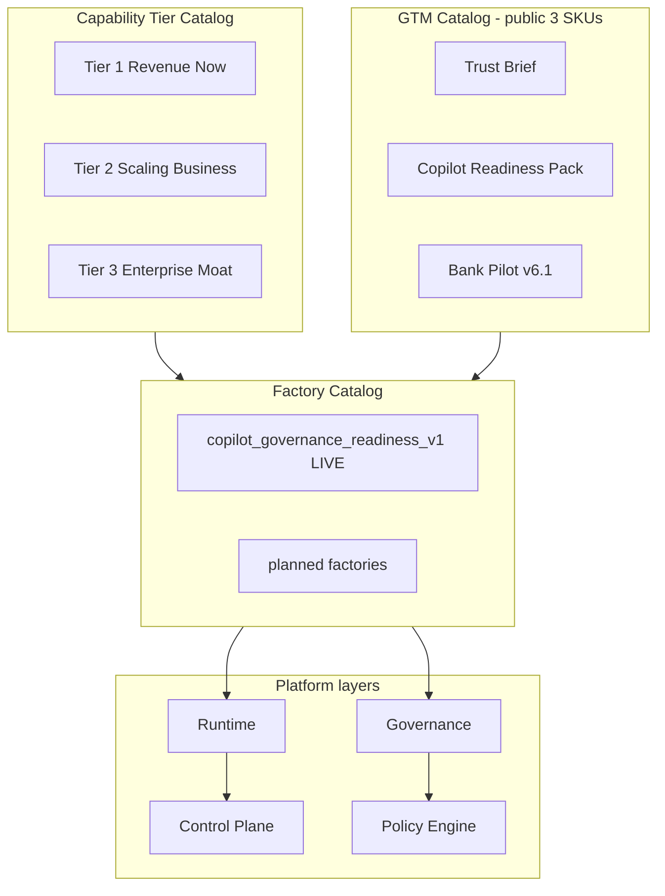

# Noetfield Catalog — Dual Registry

**Version:** 2026.06.03 · **Machine manifests:** [`governance/FACTORY_CATALOG.json`](../../governance/FACTORY_CATALOG.json) · [`governance/CAPABILITY_TIER_CATALOG.json`](../../governance/CAPABILITY_TIER_CATALOG.json)

Two registries, one runtime — tier capabilities map to factories; three public SKUs package what is contractable on www.

---

## Architecture



---

## GTM Catalog (www only — FINAL LOCK)

| SKU | Source | Factory |
|-----|--------|---------|
| Trust Brief | [`OFFERINGS.md`](../../OFFERINGS.md) §1 | `trust_brief_diligence_v1` (planned) |
| Copilot Readiness Pack | OFFERINGS §2 | `copilot_governance_readiness_v1` (**live**) |
| Bank Pilot v6.1 | OFFERINGS §3 | platform overlay — no separate factory yet |

**Rule:** Tier 1–3 items are capabilities — not new retail SKUs unless OFFERINGS is formally amended.

---

## Capability Tier Catalog

### Tier 1 — Revenue Now

| Capability | Status | Factory |
|------------|--------|---------|
| Social Content | planned | — |
| Support Agent | planned | `support_agent_bounded_v1` |
| Marketing Factory | planned | `marketing_artifact_v1` |
| Admin Automation | planned | — |

### Tier 2 — Scaling Business

| Capability | Status | Factory |
|------------|--------|---------|
| Research | planned | — |
| Legal | planned | `legal_review_v1` |
| Finance | **restricted** | governance overlay only |
| HR | planned | — |

### Tier 3 — Enterprise Moat

| Capability | Status | Factory | GTM SKU |
|------------|--------|---------|---------|
| Compliance | **live** | `copilot_governance_readiness_v1` | Copilot Readiness Pack |
| Due Diligence | partial | `trust_brief_diligence_v1` | Trust Brief |
| RAG Systems | planned | — | — |
| E-commerce Engine | **blocked** | `ecommerce_engine_v1` | — |

---

## Factory Catalog (platform stack)

| Factory | Tier | Status | Route |
|---------|------|--------|-------|
| Copilot Governance Readiness | T3 | **live** | `POST /factories/copilot_governance_readiness_v1/run` |
| Trust Brief Due Diligence | T3 | planned | — |
| Legal Review | T2 | planned | — |
| AML Governance Trace | T3 | planned | — |
| Marketing Artifact | T1 | planned | — |
| Support Agent Bounded | T1 | planned | — |
| RWA Governance Overlay | — | deferred | governance trace only |
| E-commerce Engine | T3 | **blocked** | conflicts with NORTH_STAR |

Named aliases (M&A, RWA, Legal, AML) map to factory IDs in `CAPABILITY_TIER_CATALOG.json` → `factory_catalog_entries`.

---

## Platform layer → code

| Layer | Anchor |
|-------|--------|
| Governance | `services/governance/noetfield_governance/golden_edge_v3.py` |
| Runtime | `services/governance/noetfield_governance/api.py` |
| Control Plane | `services/workflow/noetfield_workflow/state_machine.py` |
| Policy Engine | `services/governance/noetfield_governance/policy_pack.py` |
| Factory Catalog | `services/factories/noetfield_factories/` |

---

## API (platform only)

| Endpoint | Purpose |
|----------|---------|
| `GET /catalog/tiers` | Full tier tree + factory aliases |
| `GET /factories` | Factory registry with tier, status, SKU |
| `POST /factories/{id}/run` | Execute **live** factories only |

---

## Blocked (do not implement as products)

- **RWA settlement OS** — registry rule; overlay trace only if deferred factory approved
- **E-commerce execution** — conflicts with non-custodial NORTH_STAR
- **Fourth retail SKU** — OFFERINGS FINAL LOCK
- **Payment / MSB / corridor** — `forbidden_financial_actions` in policy pack

---

## Verify

```bash
make verify-factory-catalog
make verify-factory-copilot
```
