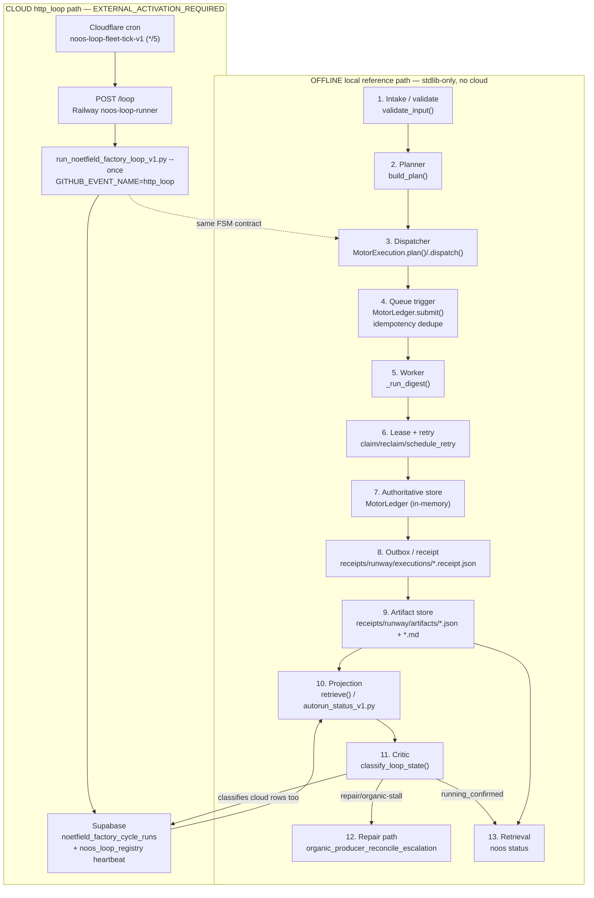
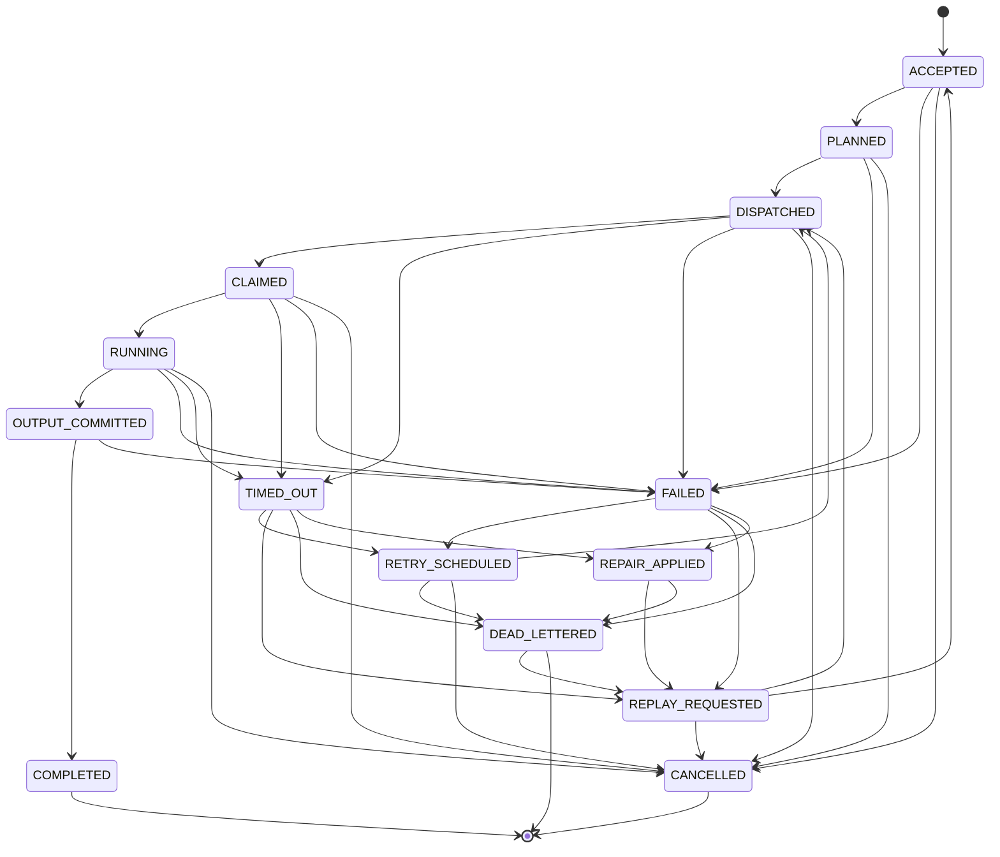

# NOOS Motor v1 — Architecture

**Product:** NOOS Motor v1 — deterministic workflow execution with verifiable
organic completion evidence, recovery, and auditable outputs.

This document maps the motor's full execution path box-by-box to the real
in-repo files, and it keeps two lanes explicitly separate:

- **OFFLINE local reference path** — the sellable vertical slice. Stdlib-only,
  no cloud, no secrets. This is what `./bin/noos demo` runs today.
- **CLOUD `http_loop` path** — the production organic producer chain. Every
  step is marked **EXTERNAL_ACTIVATION_REQUIRED** (needs cloud credentials that
  are not on the build host).

The two lanes drive the **same deterministic contract layer**
(`scripts/noos_motor_state_machine_v1.py`) and the **same provenance-aware
classifier** (`scripts/noos_observability_semantics_v1.py`). Only the store,
producer, and trigger differ.

---

## What this design fixes

The completion classifier previously keyed on receipt **age only**. Repair-labeled
rows (`cloud_trigger=noos_integrator_repair`) kept the newest row fresh and
produced a false `RUNNING_CONFIRMED`, while the organic cloud producer
(`cloud_trigger=http_loop`) had been stalled since `2026-07-12T13:50:49Z`.

The classifier is now **provenance-aware**: `RUNNING_CONFIRMED` requires **fresh
ORGANIC evidence**. Repair rows classify as `DEGRADED_REPAIR_SUSTAINED` and can
never confirm liveness. An organic stall while the sink/writer is healthy
escalates (`organic_producer_reconcile_escalation`) instead of looping back to
receipt-writer repair.

---

## The full path (chain of boxes)

| # | Box | OFFLINE local reference | CLOUD `http_loop` (EXTERNAL_ACTIVATION_REQUIRED) |
|---|---|---|---|
| 1 | API / intake boundary | `validate_input()` in `scripts/noos_motor_local_executor_v1.py` | `POST /loop` on Railway `noos-loop-runner` |
| 2 | Planner | `build_plan()` (deterministic step plan + `plan_hash`) | `run_noetfield_factory_loop_v1.py --once` planning |
| 3 | Dispatcher | `MotorExecution.plan()` / `.dispatch()` in `scripts/noos_motor_state_machine_v1.py` | same FSM contract, driven cloud-side |
| 4 | Queue / workflow trigger | `MotorLedger.submit()` (idempotency-key dedupe) | Cloudflare cron worker `noos-loop-fleet-tick-v1` (`*/5`) POSTs `/loop` |
| 5 | Worker | `_run_digest()` — the real transform | `run_noetfield_factory_loop_v1.py --once` (`GITHUB_EVENT_NAME=http_loop`) |
| 6 | Lease + retry layer | `.claim()` / `.reclaim()` / `.schedule_retry()` / `backoff_seconds()` | same FSM contract |
| 7 | Authoritative store | `MotorLedger` (in-memory: dedupe + dead-letter + replay lineage) | Supabase `noetfield_factory_cycle_runs` (+ `noos_loop_registry` dispatch heartbeat) |
| 8 | Outbox / event path | lifecycle receipt -> `receipts/runway/executions/<id>.receipt.json` | cycle-run row + dispatch heartbeat row |
| 9 | Output artifact store | `receipts/runway/artifacts/<id>.output.json` + `<id>.report.md` | artifact reference via `artifact_uri` |
| 10 | Projection | `retrieve()` (local) — cockpit projection via `scripts/autorun_status_v1.py` | `scripts/autorun_status_v1.py` reads the Supabase store |
| 11 | Critic | `scripts/noos_observability_semantics_v1.py` — `classify_loop_state()` | same classifier |
| 12 | Repair path | `DEGRADED_REPAIR_SUSTAINED` / `COMPLETION_UNPROVEN` -> `organic_producer_reconcile_escalation` | escalation only; producer restart is founder-gated |
| 13 | Customer retrieval | `retrieve()` / `./bin/noos status <id>` (output + receipt + integrity check) | projection read replicas |

> Projections and mirrors are **read replicas**. The authoritative store is the
> only source of truth for liveness — offline that is `MotorLedger`; in cloud it
> is Supabase `noetfield_factory_cycle_runs`.

---

## Chain diagram (two lanes)



Both lanes converge on one projection (`autorun_status_v1.py`) and one critic
(`classify_loop_state()`). The critic reads provenance off each completion row
(`runner_output.cloud_trigger` / `cloud_trigger` / `receipt_origin`) and only
promotes a loop to `RUNNING_CONFIRMED` on **fresh organic** evidence.

---

## Lifecycle state machine

Deterministic FSM in `scripts/noos_motor_state_machine_v1.py`. The transition
table (`VALID_TRANSITIONS`) is the single source of truth; illegal transitions
raise `InvalidTransition`.



- **Happy path:** `ACCEPTED -> PLANNED -> DISPATCHED -> CLAIMED -> RUNNING ->
  OUTPUT_COMMITTED -> COMPLETED`.
- **Terminals:** `FAILED`, `TIMED_OUT`, `CANCELLED`, `DEAD_LETTERED`.
- **Recovery:** `RETRY_SCHEDULED`, `REPLAY_REQUESTED`, `REPAIR_APPLIED`.
- `COMPLETED` is reachable **only** via `OUTPUT_COMMITTED` (a run cannot complete
  before it produces output); `COMPLETED` and `CANCELLED` are final.

---

## Reliability model

- **Idempotency dedupe** — same `task_kind` + input hash yields one logical run
  (`idempotency_key_for()`, `MotorLedger.submit()` returns the existing run for a
  duplicate).
- **Lease** — owner + expiry; `reclaim()` deterministically recovers an expired
  lease by returning the item to the queue before re-claiming.
- **Bounded exponential backoff** — `base 5s * 2^retry`, capped at `900s`
  (`backoff_seconds()`).
- **Max retries** — default `3`; exhausting the budget routes to dead-letter.
- **Dead-letter** — a real, inspectable terminal (`MotorLedger.dead_letters()`),
  replayable.
- **Replay** — creates a **new attempt** that preserves `root_execution_id` and
  `correlation_id` lineage; replay carries `receipt_origin=replay`.
- **Repair never rewrites organic provenance** — immutable fields
  (`producer`, `execution_origin`, `correlation_id`, `root_execution_id`) are
  guarded; a mutation attempt raises `ProvenanceViolation`.

---

## Health / liveness states (critic output)

Produced by `classify_loop_state()` from two independent signals — the dispatch
heartbeat and the completion receipt — plus provenance.

| State | Meaning | Route |
|---|---|---|
| `RUNNING_CONFIRMED` | fresh **organic** completion + fresh dispatch | none |
| `DEGRADED_REPAIR_SUSTAINED` | freshness sustained by repair rows, not organic | `organic_producer_reconcile_escalation` |
| `COMPLETION_UNPROVEN` | dispatch active, no fresh organic proof | `organic_producer_reconcile_escalation` |
| `EVIDENCE_INCONSISTENT` | signals disagree | `observer_reconciliation` |
| `STOPPED_OR_IDLE` | inactivity expected by configuration | none |

Legacy states remain supported for the age-only path:
`DISPATCHING_COMPLETION_UNPROVEN`, `OBSERVER_DIVERGENCE_OR_REPLAY`,
`LOOP_EXECUTION_STALE`, `OBSERVER_UNAVAILABLE`.

**Provenance origins:** `organic`, `repair`, `replay`, `manual`, `migration`,
`test`, `legacy_unknown`. Only `organic` satisfies the `RUNNING_CONFIRMED` gate;
unknown provenance is never guessed as organic.

---

## Data contracts

**Input (digest task):**

```json
{ "task_kind": "digest", "title": "...", "records": [ { } ] }
```

Sample: `docs/product/samples/sample-input.json`.

**Output:** a normalized JSON artifact + a Markdown report + a lifecycle receipt
carrying `output_hash` (integrity-checkable on retrieval — `retrieve()` sets
`output_integrity_ok`).

**Receipt fields:** `execution_id`, `attempt_id`, `correlation_id`,
`dispatch_id`, `idempotency_key`, `producer`, `receipt_origin`,
`execution_plane`, `workflow_version`, `schema_version`, `state`, `input_hash`,
`output_hash`, `artifact_uri`, `error_code`, `error_summary`, `created_at`,
`updated_at`, `history[]`.

---

## Components (all in-repo)

| File | Role |
|---|---|
| `scripts/noos_motor_state_machine_v1.py` | deterministic lifecycle FSM + invariants (pure) |
| `scripts/noos_motor_local_executor_v1.py` | OFFLINE reference executor (sellable vertical slice; no cloud) |
| `scripts/noos_observability_semantics_v1.py` | provenance-aware classifier (`classify_loop_state`, `normalize_receipt_origin`, `derive_completion_provenance`) |
| `scripts/autorun_status_v1.py` | live cockpit projection (passes provenance to the classifier) |
| `scripts/noos_motor_v1_verify_v1.py` | canonical verification |
| `scripts/noos_motor_v1_package_v1.py` | release packager (manifest + `tar.gz` bundle) |
| `bin/noos` | CLI: `install` \| `start` \| `status <id>` \| `demo` \| `verify` \| `package` \| `rollback` |
| `infrastructure/supabase/migrations/0020_motor_provenance_fields.sql` | additive provenance columns (NOT applied; founder/L5-gated) |
| `.env.example` | config reference (no secrets; local executor needs none) |

---

## Cloud organic chain (production)

**EXTERNAL_ACTIVATION_REQUIRED** — needs cloud credentials not on the build host:

```
Cloudflare cron worker noos-loop-fleet-tick-v1 (*/5)
  -> POST /loop
  -> Railway executor noos-loop-runner
  -> run_noetfield_factory_loop_v1.py --once  (env GITHUB_EVENT_NAME=http_loop)
  -> Supabase noetfield_factory_cycle_runs
  -> autorun_status_v1.py projection
  -> classify_loop_state()
```

Outstanding cloud activation steps (each **EXTERNAL_ACTIVATION_REQUIRED**):

- Restart the cloud `http_loop` producer.
- Apply Supabase migration `0020` (`make supabase-migrate`) — additive/nullable,
  founder/L5-gated, delivered ready-to-apply but **NOT** applied by the machine.
- Run 3 consecutive real cloud organic `http_loop` cycles.

---

## Security boundary

- No secrets committed. Real secrets live in `~/.noetfield-platform-secrets/`
  (outside the repo).
- The local executor is **stdlib-only and fully offline**.
- Deploy, migrate, spend, and commercial/external sends are **founder-gated**.

---

## Commands

```bash
./bin/noos demo                 # representative customer input -> real output
./bin/noos verify               # deterministic self-verification
./bin/noos package              # build release manifest + bundle
./bin/noos status <execution_id>
python3 scripts/noos_motor_local_executor_v1.py --input docs/product/samples/sample-input.json --json
```

---

SUBMITTED for independent verification (author != subject). canon_version: FOUNDER_CANON_v1+MACHINE_LOOPS_v1
