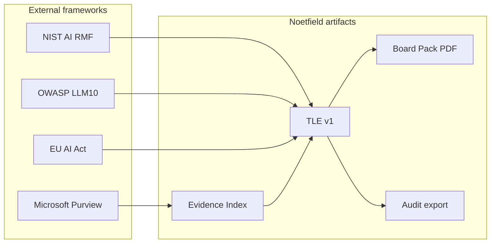

# Governance Sources Book v1 — for Noetfield business use

**Status:** Living reference (v1 locked 2026-06-04)  
**Path:** `docs/reference/GOVERNANCE_SOURCES_BOOK_v1.md`  
**Audience:** Founders, design partners, agents (`noetfield_cloud`)  
**Product mapping:** Trust Ledger (TLE), Evidence Index, Copilot Readiness, board PDF

This is a **curated handbook**, not legal advice. Verify URLs before customer-facing use; regulation dates change.

---

## How to use this book

| You need… | Read… |
|-----------|--------|
| Buyer-safe citation | Part A — Tier 1 primary sources |
| Copilot + M365 controls | Part B — Microsoft Purview |
| LLM security tests | Part C — OWASP LLM Top 10 |
| EU prospect | Part D — EU AI Act (EUR-Lex) |
| Management-system language | Part E — ISO 42001, NIST AI RMF |
| What Noetfield maps to | Part F — TLE / evidence mapping |
| 5-minute demo talk track | [NOETFIELD_GTM_60_DAY_LOCKED_v1.md](../strategy/NOETFIELD_GTM_60_DAY_LOCKED_v1.md) |
| Drift detection sources | [GOVERNANCE_DRIFT_DETECTION_SOURCES_v1.md](./GOVERNANCE_DRIFT_DETECTION_SOURCES_v1.md) |

**Reliability key**

- **Primary** — standards body, government, or vendor official docs  
- **Secondary** — reputable explainer (use only to orient; cite primary in contracts)

---

## Part A — Tier 1: International & US frameworks (primary)

### A1. NIST AI Risk Management Framework (AI RMF 1.0)

| Field | Value |
|-------|--------|
| Publisher | National Institute of Standards and Technology (US) |
| Reliability | **Primary** — voluntary US government framework, widely adopted |
| Core functions | **Govern, Map, Measure, Manage** |
| PDF | https://doi.org/10.6028/NIST.AI.100-1 |
| Hub | https://www.nist.gov/itl/ai-risk-management-framework |
| Resource Center | https://airc.nist.gov/ |

**Why Noetfield cares:** Maps to pre-deployment governance (Map/Measure) and ongoing oversight (Govern/Manage). TLE = **decision record** after Map/Measure; approval chain = **Govern**.

**Buyer line:** “Aligned with NIST AI RMF Govern and Manage outcomes — documented in your Trust Ledger Entry.”

---

### A2. NIST Generative AI Profile (NIST AI 600-1)

| Field | Value |
|-------|--------|
| Published | July 2024 |
| Reliability | **Primary** — companion to AI RMF for GenAI |
| Publication | https://www.nist.gov/publications/artificial-intelligence-risk-management-framework-generative-artificial-intelligence |
| DOI | https://doi.org/10.6028/NIST.AI.600-1 |

**Why Noetfield cares:** Copilot and LLM assistants are in scope. Use for **GenAI-specific** risk language in readiness packs.

---

### A3. OECD Recommendation on AI (AI Principles)

| Field | Value |
|-------|--------|
| Reliability | **Primary** — first intergovernmental AI standard; updated May 2024 |
| Overview | https://oecd.ai/en/ai-principles |
| Legal instrument | https://legalinstruments.oecd.org/en/instruments/OECD-LEGAL-0449 |
| Topic hub | https://www.oecd.org/en/topics/ai-principles.html |

**Values (5):** inclusive growth; human rights & fairness; transparency; robustness & safety; accountability.

**Why Noetfield cares:** Procurement in OECD markets expects **accountability** and **transparency** — TLE + evidence table delivers both.

---

### A4. ISO/IEC 42001:2023 — AI management systems

| Field | Value |
|-------|--------|
| Reliability | **Primary** — international MSS for AI (not product certification of one app) |
| Standard page | https://www.iso.org/standard/42001 |
| Explainer | https://www.iso.org/home/insights-news/resources/iso-42001-explained-what-it-is.html |

**Why Noetfield cares:** Customers pursuing **AIMS certification** need evidence of AI lifecycle control. Noetfield provides **engagement-level** artifacts (TLE, audit export), not full ISO certification.

**Buyer line:** “Supports your ISO 42001 evidence pack for specific Copilot adoption decisions.”

---

### A5. NIST Cybersecurity Framework (CSF) 2.0

| Field | Value |
|-------|--------|
| Reliability | **Primary** — enterprise security baseline |
| CSF 2.0 | https://www.nist.gov/cyberframework |

**Why Noetfield cares:** Copilot governance sits inside **Identify / Protect / Govern**. Cross-walk TLE controls to CSF **Govern** category when selling to CISOs.

---

## Part B — Microsoft Copilot & M365 (primary vendor)

### B1. Purview — AI / Copilot protections (overview)

| Field | Value |
|-------|--------|
| Reliability | **Primary** — Microsoft Learn |
| URL | https://learn.microsoft.com/en-us/purview/ai-microsoft-purview |

**Topics:** DSPM for AI, DLP for Copilot, posture recommendations, generative AI app coverage.

**Noetfield connector design:** [connectors-m365-v1.md](../spec/connectors-m365-v1.md) — metadata-only, read-only scopes.

---

### B2. DLP for Microsoft 365 Copilot and Copilot Chat

| Field | Value |
|-------|--------|
| Reliability | **Primary** |
| Learn | https://learn.microsoft.com/en-us/purview/dlp-microsoft365-copilot-location-learn-about |
| DLP fundamentals | https://learn.microsoft.com/en-us/purview/dlp-learn-about-dlp |
| Policy reference | https://learn.microsoft.com/en-us/purview/dlp-policy-reference |

**Evidence types Noetfield stubs mirror:** sensitivity labels, SITs in prompts, blocking external web search on sensitive prompts.

**Buyer line:** “We index Purview/DLP **evidence** into your TLE — what you configured, not what we replace.”

---

### B3. Microsoft compliance — ISO 42001 offering

| Field | Value |
|-------|--------|
| URL | https://learn.microsoft.com/en-us/compliance/regulatory/offering-iso-42001 |

**Use:** When buyer asks “does Microsoft Copilot satisfy ISO 42001?” — clarify: Microsoft attests **its** AI systems; **customer** still needs **their** adoption decision record (TLE).

---

### B4. Microsoft Responsible AI & Copilot Trust

| Field | Value |
|-------|--------|
| Responsible AI Standard (public materials) | https://www.microsoft.com/en-us/ai/responsible-ai |
| Copilot Trust / transparency | Search “Microsoft Copilot Trust Center” on microsoft.com |

**Use:** Compare **vendor** commitments vs **customer** governance obligation — Noetfield fills the customer gap.

---

## Part C — LLM application security (primary)

### C1. OWASP Top 10 for LLM Applications (2025)

| Field | Value |
|-------|--------|
| Reliability | **Primary** — community standard under OWASP Foundation |
| Project | https://genai.owasp.org/ |
| PDF (2025) | https://owasp.org/www-project-top-10-for-large-language-model-applications/assets/PDF/OWASP-Top-10-for-LLMs-v2025.pdf |

| ID | Risk | Noetfield control angle |
|----|------|-------------------------|
| LLM01:2025 | Prompt injection | Evaluate + DLP evidence; human approval before production |
| LLM02:2025 | Sensitive information disclosure | Purview DLP + metadata evidence in TLE |
| LLM03:2025 | Supply chain | Connector registry + manifest |
| LLM06:2025 | Excessive agency | No execution rights in PRODUCT_TRUTH; review workflow |
| LLM09:2025 | Misinformation | Confidence score + human sign-off; not auto-approve |

**Buyer line:** “Readiness assessment references OWASP LLM Top 10; TLE documents residual risk acceptance.”

---

## Part D — EU regulatory (primary law)

### D1. EU Artificial Intelligence Act — Regulation (EU) 2024/1689

| Field | Value |
|-------|--------|
| Reliability | **Primary** — binding EU law |
| EUR-Lex (English) | https://eur-lex.europa.eu/eli/reg/2024/1689/oj/eng |
| Summary | https://eur-lex.europa.eu/EN/legal-content/summary/rules-for-trustworthy-artificial-intelligence-in-the-eu.html |

**Risk-based approach:** prohibited practices; high-risk requirements; GPAI transparency.

**Why Noetfield cares:** EU buyers need **documentation of deployer decisions**. TLE = structured deployer/governance decision for Copilot rollout (not a CE mark).

**Caution:** Do not claim “EU AI Act compliant” without legal review — say **“decision documentation aligned with EU AI Act documentation duties.”**

---

## Part E — Enterprise IT governance (selective primary)

### E1. COBIT 2019 (ISACA)

| Field | Value |
|-------|--------|
| Reliability | **Primary** (paid framework; public summaries exist) |
| ISACA | https://www.isaca.org/resources/cobit |

**Use:** Map TLE approvals to **EDM** (evaluate, direct, monitor) when speaking to IT audit leaders.

---

### E2. SOC 2 (AICPA Trust Services Criteria)

| Field | Value |
|-------|--------|
| Reliability | **Primary** — AICPA |
| Use | When buyer conflates “SOC 2” with “AI governance” — clarify SOC 2 ≠ Copilot adoption decision; TLE complements vendor SOC reports |

---

## Part F — Noetfield product mapping (internal)



| Framework topic | Noetfield artifact | API / surface |
|-----------------|-------------------|---------------|
| Risk assessment | Evaluate + confidence factors | `POST /evaluate`, TLE draft |
| Evidence of controls | Evidence Index | `POST /evidence/ingest`, M365 connector |
| Management decision | TLE + approval chain | `POST /tle/draft`, `POST /tle/{id}/approve` |
| Board / procurement | PDF + YAML | `GET /tle/{id}/export?format=pdf` |
| Audit trail | audit_digest + signature_block | Export JSON, audit export |
| Pilot repeatability | E2E script | `make copilot-pilot-e2e` |

**In-repo specs:** [copilot-control-catalog.md](../spec/copilot-control-catalog.md), [rbac-approval-matrix.md](../spec/rbac-approval-matrix.md), [evidence-intake-contract-v1.md](../spec/evidence-intake-contract-v1.md).

---

## Part G — What we intentionally exclude

| Source type | Why excluded |
|-------------|--------------|
| Random SEO blogs | Not citable in procurement |
| Paywalled analyst-only (Gartner, Forrester) | Cannot reproduce; refer buyer to their subscription |
| TrustField / crypto governance | Wrong product boundary |
| Lane C (payments) | Out of PRODUCT_TRUTH |

---

## Part H — Quick citation templates

**Footnote style**

> National Institute of Standards and Technology, *Artificial Intelligence Risk Management Framework (AI RMF 1.0)*, NIST AI 100-1, January 2023, https://doi.org/10.6028/NIST.AI.100-1

**EU AI Act**

> Regulation (EU) 2024/1689 (Artificial Intelligence Act), OJ L 2024/1689, EUR-Lex: https://eur-lex.europa.eu/eli/reg/2024/1689/oj/eng

**Microsoft DLP Copilot**

> Microsoft, "Learn about DLP for Microsoft 365 Copilot," Microsoft Learn, https://learn.microsoft.com/en-us/purview/dlp-microsoft365-copilot-location-learn-about

---

## Part I — Maintenance

| Action | Owner |
|--------|--------|
| Verify links quarterly | Agent / founder |
| Add new primary source | PR to this file + `LOCKED_REFERENCE_INDEX.md` |
| Customer-specific legal claims | **Legal counsel only** |

**Version:** v1 — 2026-06-04 — initial lock with NIST, OECD, ISO 42001, EU AI Act, Microsoft Purview, OWASP LLM 2025.

---

## Agent pointer (copy-paste)

```
Read: docs/reference/GOVERNANCE_SOURCES_BOOK_v1.md
GTM: docs/strategy/NOETFIELD_GTM_60_DAY_LOCKED_v1.md
```

Do not edit SourceA or SinaPromptOS when updating this book — **Noetfield repo only**.
