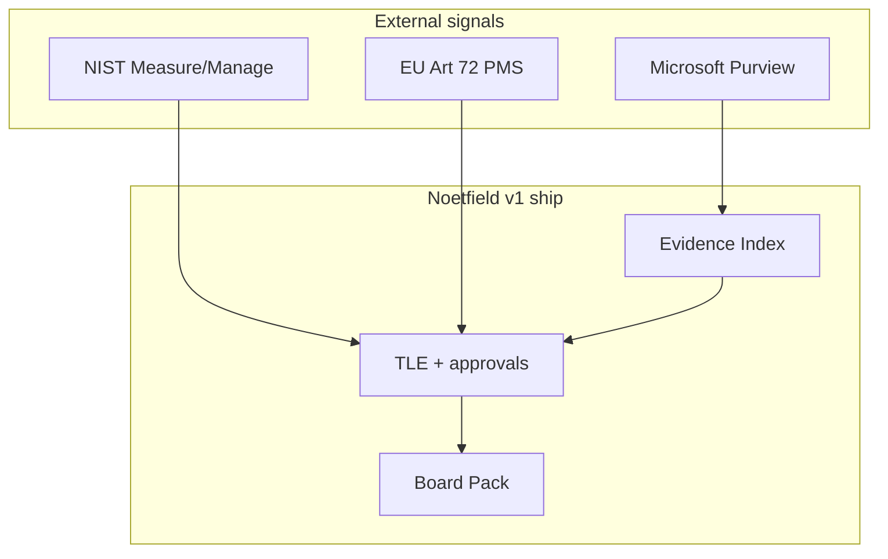

# Governance Drift Detection — Sources Book v1

> **Canonical for agents:** prefer [GOVERNANCE_DRIFT_DETECTION_SOURCES_LOCKED_v1.md](./GOVERNANCE_DRIFT_DETECTION_SOURCES_LOCKED_v1.md). This file remains for historical nf-1000 prompt context budgets.

**Status:** Living reference (v1 locked 2026-06-04)  
**Path:** `docs/references/GOVERNANCE_DRIFT_DETECTION_SOURCES_v1.md`  
**Companion:** [GOVERNANCE_SOURCES_BOOK_v1.md](./GOVERNANCE_SOURCES_BOOK_v1.md) (frameworks) · [NOETFIELD_GTM_60_DAY_LOCKED_v1.md](../strategy/NOETFIELD_GTM_60_DAY_LOCKED_v1.md) (GTM)  
**Audience:** Founders, design partners, agents (`noetfield_cloud`)

Curated **primary** and **selected secondary** sources on detecting when governance, policy, controls, or AI behavior **drift** from what was documented, approved, or baselined. Not legal advice.

---

## How to use this book

| You need… | Read… |
|-----------|--------|
| Definition + taxonomy | §1 below |
| Regulatory / standards language | Part A |
| Copilot / M365 drift | Part B |
| Config / policy-as-code drift | Part C |
| Continuous GRC / CCM | Part D |
| Agent / LLM behavioral drift | Part E |
| Noetfield product mapping | Part F |
| Buyer-safe one-liner | Part G |

**Reliability key**

- **Primary** — standards body, government, official vendor docs, CNCF/open spec  
- **Secondary** — reputable explainer; cite **primary** in contracts  
- **Vendor marketing** — orientation only; not procurement authority  

---

## §1 — What “governance drift” means

**Governance drift** is the growing gap between:

1. **Intended state** — policies, approvals, risk assessments, baselines, TLE decisions, and control design; and  
2. **Actual state** — live configs, Copilot interactions, model/agent behavior, evidence freshness, and operational practice.

Drift is continuous between formal audits. Detection requires **ongoing monitoring**, not point-in-time checklists.

| Drift type | Example signal | Typical detector |
|-----------|------------------|------------------|
| **Control drift** | DLP disabled after dependency upgrade | Purview policies, CCM, Config rules |
| **Policy drift** | Password policy changed in console, not in GRC record | GRC drift tools, IaC scan |
| **Configuration drift** | S3 public after hotfix | AWS Config, Terraform plan diff |
| **Model / data drift** | Accuracy drop; input distribution shift | MLOps monitors, NIST Measure |
| **Behavioral / agent drift** | Tool-call rate spike; rogue patterns | AGT baselines, Purview agent inventory |
| **Documentation drift** | Board pack claims controls that production no longer has | Evidence re-ingest + TLE review |
| **Epistemic drift** (Noetfield internal) | Multi-agent answers diverge from SOT | Manifest hash, `drift_summary` in evidence packs |

---

## Part A — Standards & regulation (primary)

### A1. NIST AI RMF 1.0 — Measure & Manage (drift in production)

| Field | Value |
|-------|--------|
| Reliability | **Primary** |
| Publication | https://doi.org/10.6028/NIST.AI.100-1 |
| PDF | https://nvlpubs.nist.gov/nistpubs/ai/nist.ai.100-1.pdf |
| Playbook — Measure | https://airc.nist.gov/airmf-resources/playbook/measure/ |
| Playbook — Manage | https://airc.nist.gov/airmf-resources/playbook/manage/ |
| Resource Center | https://airc.nist.gov/ |

**Drift language (official):**

- **Measure:** AI in production should be monitored; environment evolves → **“drift”** means assumptions of original design no longer hold; compare production metrics to pre-deployment testing.  
- **Manage:** **“Drift”** can degrade value and increase negative impacts; **regular monitoring** of performance and trustworthiness enables detect/respond; post-deployment monitoring plans required.

**Noetfield mapping:** TLE approval = baseline decision; re-evaluate / new TLE when evidence or Purview signals show drift.

**Buyer line:** “Post-deployment oversight aligned with NIST AI RMF Measure and Manage — decisions recorded in the Trust Ledger when drift triggers review.”

---

### A2. NIST Generative AI Profile (AI 600-1)

| Field | Value |
|-------|--------|
| Reliability | **Primary** |
| DOI | https://doi.org/10.6028/NIST.AI.600-1 |
| Hub | https://www.nist.gov/publications/artificial-intelligence-risk-management-framework-generative-artificial-intelligence |

**Why:** GenAI/Copilot risks change faster than static policies — profile supports **ongoing** risk actions, not one-time sign-off.

---

### A3. ISO/IEC 42001:2023 — Clause 9.1 & Annex A.6.2.6

| Field | Value |
|-------|--------|
| Reliability | **Primary** (paid standard; public summaries for orientation) |
| Standard | https://www.iso.org/standard/81230.html |
| Clause 9 orientation (secondary) | https://www.iso.org/standard/81230.html — use licensed text for audits |

**Requirements (paraphrase for sales — verify against licensed standard):**

- **9.1:** Determine what to monitor/measure, methods, frequency, analysis, **documented results**.  
- **A.6.2.6:** Operation & monitoring — performance, errors, **model drift**, incident hooks.

**Drift terms in AIMS practice:** data drift, concept drift, performance degradation, bias emergence.

**Noetfield mapping:** Evidence ingest timestamps + TLE = documented monitoring results; PDF = management review input.

---

### A4. EU AI Act — Post-market monitoring (Art. 72)

| Field | Value |
|-------|--------|
| Reliability | **Primary** (EU law) |
| Regulation | https://eur-lex.europa.eu/eli/reg/2024/1689/oj/eng |
| Art. 72 (readable) | https://artificialintelligenceact.eu/article/72/ |
| Chapter IX overview | https://digitalhorizon.hannessnellman.com/ai-strategy/ai-regulation-air/chapter-ix-post-market-monitoring-information-sharing-market-surveillance-art-72-94/ |

**Obligation (high-risk providers):** Establish and document a **post-market monitoring system** for the system lifetime; plan in **Annex IV** technical documentation; actively collect/analyze performance data; evaluate **continuous compliance** with Ch. III §2.

**Drift relevance:** Performance drops (accuracy, bias, safety) in real operation = trigger for corrective action — functionally **governance drift detection** under EU law.

**Noetfield mapping:** TLE + evidence trail = audit narrative for “what we knew when” and “what we decided after signal”; not a full Art. 72 PMS substitute.

---

### A5. OECD AI Principles — accountability & oversight

| Field | Value |
|-------|--------|
| Reliability | **Primary** |
| Principles | https://oecd.ai/en/ai-principles |
| Instrument | https://legalinstruments.oecd.org/en/instruments/OECD-LEGAL-0449 |

**Drift relevance:** **Accountability** and **robustness** imply monitoring that systems remain within governed bounds over time.

---

### A6. NIST SP 800-53 Rev. 5 — CA-7 Continuous Monitoring

| Field | Value |
|-------|--------|
| Reliability | **Primary** |
| Control text | https://csf.tools/reference/nist-sp-800-53/r5/ca/ca-7/ |
| FedRAMP CA-7 | https://fedramp.scalesec.com/low/ca-7/ |
| RMF Monitor Step FAQ | https://csrc.nist.gov/CSRC/media/Projects/risk-management/documents/07-Monitor%20Step/NIST%20RMF%20Monitor%20Step-FAQs.pdf |

**Drift relevance:** Configurations **do not stay** as deployed; automated tools find **misconfigurations, unauthorized changes**, undiscovered components — classic **configuration/control drift**.

**Related controls:** CM-2, CM-3, CM-6, SI-4, SI-7 (baseline, change control, monitoring, integrity).

---

### A7. NIST Cybersecurity Framework 2.0 — GOVERN / IDENTIFY ongoing

| Field | Value |
|-------|--------|
| Reliability | **Primary** |
| CSF | https://www.nist.gov/cyberframework |

**Drift relevance:** **Continuous improvement** and asset/risk updates — GRC programs map CCM to CSF outcomes.

---

## Part B — Microsoft 365 / Copilot (primary vendor)

### B1. Purview — AI data security & compliance (hub)

| Field | Value |
|-------|--------|
| Reliability | **Primary** |
| AI + Purview | https://learn.microsoft.com/en-us/purview/ai-microsoft-purview |
| M365 Copilot | https://learn.microsoft.com/en-us/purview/ai-m365-copilot |
| DSPM for AI | https://learn.microsoft.com/en-us/purview/dspm-for-ai |
| DLP Copilot | https://learn.microsoft.com/en-us/purview/dlp-microsoft365-copilot-location-learn-about |
| What's new (posture drift reports) | https://learn.microsoft.com/en-us/purview/whats-new |

**Drift detection surfaces:**

- **DSPM for AI** — weekly data risk assessment; oversharing vs Copilot readiness.  
- **Communication Compliance** — risky Copilot interactions (prompt injection, sensitive exfil patterns).  
- **Audit / Activity Explorer** — who used Copilot, when, what content class.  
- **Posture reports** — label transitions, DLP activity → **posture drift** language in product docs.  
- **Agent inventory** — agent risk level, agentic interactions (preview/GA per doc revision).

**Noetfield mapping:** M365 connector evidence IDs → Evidence Index → TLE cites Purview state at decision time.

---

### B2. Microsoft Agent Governance Toolkit (AGT) — behavioral drift

| Field | Value |
|-------|--------|
| Reliability | **Primary** (open source, Microsoft) |
| Repo | https://github.com/microsoft/agent-governance-toolkit |
| NIST alignment doc | https://microsoft.github.io/agent-governance-toolkit/compliance/nist-ai-rmf-alignment/ |

**Drift components (documented in alignment):**

- `BehaviorBaseline`, `DriftDetector`, `RogueAgentDetector`  
- MCP drift detector, flight recorder, ring breach detection  

**Noetfield mapping:** Buyer proof for **agentic** programs; Noetfield TLE documents human approval when automated drift alerts fire.

---

### B3. Azure AI — Prompt Shields / safety (runtime)

| Field | Value |
|-------|--------|
| Reliability | **Primary** |
| Prompt Shields | https://learn.microsoft.com/en-us/azure/ai-services/content-safety/concepts/jailbreak-detection |

**Drift relevance:** Attack patterns evolve → **detection** must be continuous, not only at Copilot rollout.

---

## Part C — Policy-as-code & infrastructure drift (primary tooling)

### C1. Open Policy Agent (OPA) — CNCF

| Field | Value |
|-------|--------|
| Reliability | **Primary** |
| Project | https://www.openpolicyagent.org/ |
| Docs | https://www.openpolicyagent.org/docs/latest/ |

**Use:** Rego policies in CI/CD (Conftest) + optional live scans → **policy drift** vs declared rules.

---

### C2. OPA Gatekeeper (Kubernetes)

| Field | Value |
|-------|--------|
| Reliability | **Primary** |
| Docs | https://open-policy-agent.github.io/gatekeeper/website/docs/ |

**Use:** Admission + audit → cluster config drift from org baseline.

---

### C3. Kyverno

| Field | Value |
|-------|--------|
| Reliability | **Primary** |
| Site | https://kyverno.io/ |

**Use:** Kubernetes policy-as-code; compare with OPA for buyer’s stack.

---

### C4. AWS Config — configuration drift

| Field | Value |
|-------|--------|
| Reliability | **Primary** |
| What is AWS Config | https://docs.aws.amazon.com/config/latest/developerguide/WhatIsConfig.html |

**Use:** Detect resource changes vs desired rules; feeds **control drift** programs.

---

### C5. Terraform — plan-based drift

| Field | Value |
|-------|--------|
| Reliability | **Primary** |
| Drift (official) | https://developer.hashicorp.com/terraform/tutorials/state/resource-drift |

**Use:** `terraform plan` shows live vs state file — **IaC drift** before compliance audit.

---

### C6. Compliance automation framework (reference architecture)

| Field | Value |
|-------|--------|
| Reliability | **Secondary** (open repo pattern) |
| GitHub | https://github.com/sotille/compliance-automation-framework |

**Capabilities listed:** Policy-as-code (OPA/Kyverno), continuous scanning, **compliance drift detection**, evidence automation.

---

### C7. policyascode.dev — drift detection guide

| Field | Value |
|-------|--------|
| Reliability | **Secondary** |
| Guide | https://policyascode.dev/guides/infrastructure-drift-detection/ |

**Use:** Orient teams on scheduled scan vs event-driven (CloudTrail/EventBridge) patterns; cite OPA/AWS docs as authority.

---

## Part D — GRC / continuous controls monitoring (mixed)

### D1. Continuous controls monitoring (concept)

| Field | Value |
|-------|--------|
| Reliability | **Secondary** (vendor essay) / concept aligns with **NIST CA-7** |
| Secondary reference | Continuous controls monitoring (CCM) industry pattern — aligns with **NIST CA-7** |

**Idea:** Manual audit evidence goes stale immediately → **CCM** streams live control status.

---

### D2. GRC drift detection (glossary / category)

| Field | Value |
|-------|--------|
| Reliability | **Secondary** |
| ThreatNG glossary | https://www.threatngsecurity.com/glossary/grc-drift-detection |

**Definition:** Continuous comparison of **actual cybersecurity posture** vs **GRC baselines** (configs, access, assets).

---

### D3. Policy drift detection (operational GRC)

| Field | Value |
|-------|--------|
| Reliability | **Secondary** (vendor blog; methods are industry-standard) |
| Sprinto guide | https://sprinto.com/blog/policy-drift-detection/ |

**Practices:** Codify policies, CI/CD + **runtime** scans, version-controlled policy records, immutable logs.

---

### D4. Continuous compliance monitoring

| Field | Value |
|-------|--------|
| Reliability | **Secondary** |
| ioSENTRIX | https://iosentrix.com/blog/continuous-compliance-monitoring-always-on-compliance |

**Stat cited in article (verify before buyer use):** industry surveys on incidents from **control drift between audits** — treat as directional unless you re-source.

---

## Part E — AI security & agentic drift (primary + research)

### E1. OWASP Top 10 for LLM Applications (2025)

| Field | Value |
|-------|--------|
| Reliability | **Primary** |
| Project | https://owasp.org/www-project-top-10-for-large-language-model-applications/ |
| LLM10 listing | https://llmsecurity.net/llm10 (mirror; prefer owasp.org for citation) |

**Drift relevance:** Runtime behavior vs tested posture (e.g. excessive agency, supply chain) — re-test when models/prompts/tools change.

---

### E2. OWASP AI Exchange — monitoring

| Field | Value |
|-------|--------|
| Reliability | **Primary** |
| Hub | https://owasp.org/www-project-ai-security-and-privacy-guide/ |

---

### E3. Control drift / evidence gap (industry essay)

| Field | Value |
|-------|--------|
| Reliability | **Secondary** |
| Prediction Guard | https://predictionguard.com/blog/ai-governance-compliance-evidence-a-framework-for-nist-ai-rmf-nist-ai-600-1-owasp-and-eu-ai-act-audit-readiness |

**Useful term:** **Control drift** — gap between authorized AI behavior and production; argues for **per-interaction** logs vs point-in-time audits. Cite NIST/EU primary for contracts.

---

### E4. AAGATE (agentic governance research)

| Field | Value |
|-------|--------|
| Reliability | **Secondary** (academic preprint) |
| arXiv | https://arxiv.org/abs/2510.25863 |

**Use:** Shadow-monitor agents, behavioral analytics, continuous red teaming — vocabulary for **agent drift** RFPs.

---

## Part F — Noetfield internal canon (in-repo)

| Source | Path | Drift concept |
|--------|------|----------------|
| Temporal Governance OS v2 | `docs/SOURCE_OF_TRUTH/uploaded/2026-05-batch-011/noetfield-v2-temporal-governance-os-bank-grade.md` | Drift trajectory, `GET /drift`, critical drift ≥0.7 → triage ≤4h |
| Evidence pack schema | `.../noetfield-evidence-pack-json-schema-v1.md` | `drift_summary` field |
| Agent catalog | `.../noetfield-agent-catalog-bank-grade-v1.md` | Drift agent: trajectory, slope, AUC |
| Chain-lock manifest | `.../noetfield-nf-chain-lock-manifest-layer-spec-v1.md` | Runtime hash vs manifest → HARD STOP |
| Copilot SME design | `docs/strategy/NOETFIELD_COPILOT_SME_SYSTEM_DESIGN_LOCKED_v1.md` | Policy drift, model drift, task drift |
| Alignment scoring | `governance/alignment-scoring/README.md` | Drift risk weight 0.10 |
| Rule candidate | `critical-drift-triage-sla-4h` in `active_rule_candidates.json` | drift_score ≥ 0.7 → 4h triage |

**Shipped product today (Lane A):** Evidence + TLE + PDF + sequential approval — **decision-time** governance. Full drift agent/dashboard = **future** per batch-011 specs; demo should be honest about scope.



---

## Part G — Citation templates & buyer lines

**Control drift (general)**

> We treat governance as continuous: documented baselines (Trust Ledger) plus monitoring aligned with NIST AI RMF Measure/Manage and ISO 42001 Clause 9.1-style performance evaluation.

**Copilot pilot**

> Microsoft Purview DSPM for AI and DLP provide drift signals on oversharing and risky interactions; Noetfield captures the **management decision** and evidence snapshot when readiness or risk posture changes.

**EU high-risk prospect**

> Article 72 requires lifetime post-market monitoring; Noetfield supplements the **decision and evidence record**; your legal team owns the formal PMS plan template (Commission implementing act).

**Infrastructure buyer**

> Configuration drift detection (NIST SP 800-53 CA-7, AWS Config, OPA) complements AI governance — Noetfield does not replace CCM tools; it records **who approved** deploying Copilot against current evidence.

---

## Part H — Excluded (do not cite as authority)

| Source type | Why |
|-------------|-----|
| Random SEO “AI governance” listicles | Not auditable |
| Paywalled analyst research only | Buyer must use their subscription |
| TrustField / crypto governance | Product boundary |
| Unverified survey stats in blogs | Re-verify or drop |
| Lane C payment rails | Out of PRODUCT_TRUTH |

---

## Part I — Maintenance

| Action | Owner |
|--------|--------|
| Verify links quarterly | Agent / founder |
| Add EU PMS template act when published | Update A4 |
| Wire new Purview drift APIs | Update B1 |

**Version:** v1 — 2026-06-04 — initial catalog for governance drift detection sources.

---

## Agent pointer (copy-paste)

```
Drift sources: docs/references/GOVERNANCE_DRIFT_DETECTION_SOURCES_v1.md
Frameworks:    docs/references/GOVERNANCE_SOURCES_BOOK_v1.md
GTM:           docs/strategy/NOETFIELD_GTM_60_DAY_LOCKED_v1.md
```

Do not edit SourceA or SinaPromptOS when updating this book — **Noetfield repo only**.
