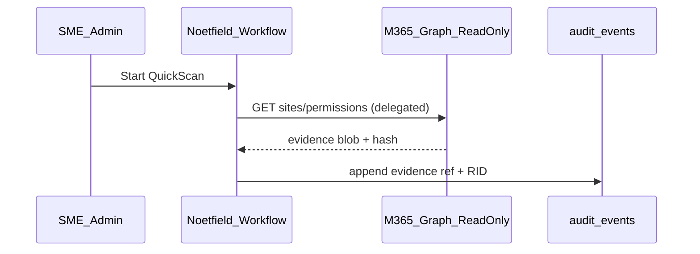

# M365 Connector Design v1 (read-only evidence)

**Status:** DESIGN — no OAuth implementation in Lane A pilot slice.

## Purpose

Ingest evidence for Copilot QuickScan / Readiness without payment or write actions.

## Scopes (read-only)

| Source | Data | Evidence type |
|--------|------|----------------|
| SharePoint / OneDrive | Site permissions snapshot | `sharepoint_site_permissions_snapshot` |
| Purview / DLP | Policy export JSON | `m365_dlp_policy_export` |
| Copilot activity | 30-day usage report | `copilot_activity_report_30d` |

## Flow

## Security

- Delegated admin consent; tenant-scoped app registration
- No `Mail.Send`, no file write, no payment APIs
- Store evidence hash + URI in workflow `payload`; full blob in object store (future)

## Pilot default

Manual upload of exports until tenant RLS + pilot auth proven (`docs/strategy/noetfield-future-path.md`).
