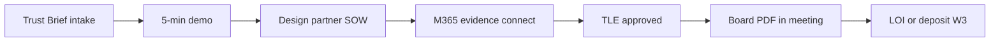

# Noetfield SME Provider Blueprint (LOCKED v1)

| Field | Value |
|-------|--------|
| **Agent tag** | `[NF-LOCAL-REPO-AGENT]` |
| **Parent SSOT** | [NOETFIELD_COMMERCIAL_SSOT_LOCKED_v1.md](./NOETFIELD_COMMERCIAL_SSOT_LOCKED_v1.md) |
| **Product mandate** | [TRUST_LEDGER_PRODUCT_BLUEPRINT_v1.2_LOCKED.md](../spec/TRUST_LEDGER_PRODUCT_BLUEPRINT_v1.2_LOCKED.md) |
| **SME architecture** | [NOETFIELD_COPILOT_SME_SYSTEM_DESIGN_LOCKED_v1.md](./NOETFIELD_COPILOT_SME_SYSTEM_DESIGN_LOCKED_v1.md) |
| **Locked** | 2026-06-12 |

---

## 0. Purpose

Elevate Noetfield from “governance docs” to a **high-grade SME provider product**: packaged Copilot governance, provable artifacts, framework-aligned diligence, and a clear 90-day design-partner path — powered by portfolio execution discipline **without** exposing internal engine brands to buyers.

---

## 1. Product stack (what “high grade” means)

| Layer | Module | Status | Proof |
|-------|--------|--------|-------|
| **Evaluate** | Governance API pre-check | Shipped | pytest · `verify-ui-e2e` |
| **Record** | TLE v1 lifecycle | Shipped | `tle-smoke.sh` |
| **Evidence** | M365 metadata connectors | Shipped | seed stub + workspace UI |
| **Export** | Board PDF + procurement ZIP | Shipped | `procurement-pack-e2e` |
| **Drift** | Governance drift v0 contract | Partial | drift blueprints locked |
| **Console** | Cognitive dashboard + workspace | Shipped | RBAC · audit export |
| **Diligence** | Sources book + handbook + RPAA one-pager | Shipped | `verify-docs-diligence` |

---

## 2. Buyer journey (SME regulated org)

| Stage | www / doc | Owner |
|-------|-----------|-------|
| Awareness | `/` · `/copilot/sme/` | Marketing copy |
| Evaluate | `/copilot/demo/` | Founder + agentic demo URL |
| Contract | SOW outline md | Founder legal |
| Deliver | `/workspace/` + API | NF engineering |
| Prove | `/copilot/procurement/` | Buyer diligence |

---

## 3. Lane A build map (executable in this repo)

From SME system design — **Lane A only**:

| Priority | Module | Repo path |
|----------|--------|-----------|
| P0 | Policy + control registry (markdown → API) | `services/governance` |
| P0 | TLE + audit export | `trust_ledger.py` |
| P1 | Copilot QuickScan / readiness | `copilot/quickscan/` |
| P1 | Procurement pack generator | `procurement_pack.py` |
| P2 | Drift diff v0 | governance-console |
| P2 | Agent preflight audit (HITL) | SME design §AI domain |
| P3 | Knowledge/RAG evidence-first | future path doc |

**Lane B/C (payments, disbursement):** partner systems only — see conflict matrix.

---

## 4. Site embed checklist (commercial front)

| Asset | Action | Path |
|-------|--------|------|
| Homepage governance loop | **Done** | `index.html` |
| Copilot SME pack page | **Done** | `copilot/sme/index.html` |
| SME one-pager md | **Done** | `docs/copilot/SME_GOVERNANCE_PACK_ONE_PAGER.md` |
| Commercial SSOT | **Done** | this doc tree |
| Demo rehearsal | Existing | `DEMO_REHEARSAL_CHECKLIST_v1.md` |
| Design partner pipeline | Existing | `DESIGN_PARTNER_PIPELINE_v1.md` |

---

## 5. Portfolio integration (internal — embed behavior, not brand)

| Source project | Embeds into Noetfield as |
|----------------|--------------------------|
| Governance validators | `make verify-gtm` · ship-verify FAIL gates |
| Agentic commercial | Outreach handoff · Hub approve · not repo send |
| TrustField wedge | Separate site · RPAA positioning cross-link only |
| Wire / factory proof | RunReceipt pattern in agent closeout YAML |
| Voice modality | Future — demo stays web-first for W3 |

---

## 6. W3 batch 1 (Noetfield copy assets)

Agentic layer uses these **disk truths** — NF-CLOUD maintains, agentic sends:

- Subject: *Board-ready audit trail for your Copilot rollout*
- Demo: `{{demo_url}}/copilot/demo/`
- Pilot: `DESIGN_PARTNER_SOW_OUTLINE.md`
- Diligence: `/copilot/procurement/`
- Guard: no $100M language · no payment claims · max 5 targets/batch

---

## 7. Film + demo alignment (W1 parallel)

**In-room story:** Noetfield product only.

**Behind the scenes:** same evaluate → receipt → export path proves portfolio engine — do not narrate engine SKU on camera.

**Tamper FAIL moment:** export integrity check in demo script (procurement README orientation).

---

## 8. Success metrics

| Metric | Target |
|--------|--------|
| `make verify-gtm` | PASS before external demo |
| Design partner | 1 org · board PDF used |
| W3 | Deposit ≥ CAD 2K or signed LOI |
| www coherence | No payment/custody claims |
| Agent scope | No TrustField/VIRLUX bleed |

---

## 9. Future agent picks (when ASF implements)

Use [os/plan-library/noetfield-1000/](../../os/plan-library/noetfield-1000/REGISTRY.json) T0 prompts tagged `copilot` · `workspace` · `procurement` — one task per turn.

---

**END**
