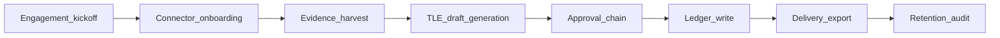

# Noetfield Trust Ledger — Final Positioning (LOCKED v1.2)

**Status:** LOCKED — supersedes generic SME Copilot breadth for GTM and product focus  
**Locked:** 2026-06-03  
**Authority:** ASF  
**Path:** `docs/strategy/NOETFIELD_TRUST_LEDGER_POSITIONING_LOCKED_v1.2.md`  
**Buyer line:** *We produce the audit trail your Copilot deployment will be asked for later.*

**Related:** [PRODUCT_TRUTH.md](../../PRODUCT_TRUTH.md) · [copilot-sme-system-design-v1](./NOETFIELD_COPILOT_SME_SYSTEM_DESIGN_LOCKED_v1.md) (Lane A only) · [tle-v1.schema.json](../../packages/schemas/tle-v1.schema.json) · [openapi/tle-v1.openapi.yaml](../spec/openapi/tle-v1.openapi.yaml)

---

## Final positioning (locked)

**Noetfield is an AI Governance & Evidence layer for Copilot adoption, delivered today as structured procurement-grade assessments and evolving into a continuous Trust Ledger system.**

| Today | Evolving to |
|-------|-------------|
| Structured procurement-grade assessments (QuickScan, Readiness) | Continuous Trust Ledger system |
| Go/No-Go signals + evidence packs | Signed TLEs on append-only ledger |
| Metadata-only M365 evidence intake | Connector-synced Evidence Index |

**Operational mandate:** Every engagement must produce at least one signed **Trust Ledger Entry (TLE v1)** — the canonical authorization record for Copilot adoption.

**Out of scope (unchanged):** Payment rails, custody, settlement, FX, money transmission ([PRODUCT_TRUTH.md](../../PRODUCT_TRUTH.md)).

---

## 1. System design (modules) — v1.2 product blueprint

**Goal:** Minimal, decision-first product that produces canonical Trust Ledger Entries (TLEs) for procurement and governance signoff.

### Core modules

| Module | Responsibility |
|--------|----------------|
| **Trust Ledger Core** | Append-only TLE store; signed digests; exportable board packs |
| **Evidence Index** | Metadata catalog (sources, hashes, retention) |
| **Evidence Intake Connector Layer** | Purview, Entra ID, M365 Audit Logs, SharePoint + optional connectors |
| **Decision Log UI (Trust Ledger Workspace v0)** | Read-only nav, search, TLE viewer, PDF/Board Pack export |
| **TLE Generator** | Template engine: intake → TLE YAML/JSON + **Confidence Score** |
| **Procurement Asset Manager** | Evidence Intake Contract generator + ingestion rules UI |
| **Auth & Audit** | RBAC, signed approvals, immutable audit trail |

### Supporting modules (light)

- **Prompt Studio (templates only)** — JSON templates for TLE creation and evidence mapping  
- **Minimal Reporting** — Board-ready PDF + one-page risk summary  

---

## 2. Execution flow (end-to-end)

1. **Engagement kickoff** — procurement pack signed; Evidence Intake Contract issued.  
2. **Connector onboarding** — metadata from required sources per contract.  
3. **Evidence harvest** — Evidence Index: hashes, sensitivity tags, refs.  
4. **TLE draft generation** — templates + evidence → TLE v1 + Confidence Score.  
5. **Approval chain** — CIO → Legal → Security signoff; signed records.  
6. **Ledger write** — final TLE to Trust Ledger Core (signed digest, immutable).  
7. **Delivery** — Workspace read-only; PDF/Board Pack; Procurement Authorization Pack.  
8. **Retention & audit** — retention rules enforced; audit export available.

---

## 3. Data objects

Canonical schema: [packages/schemas/tle-v1.schema.json](../../packages/schemas/tle-v1.schema.json)  
Examples: [docs/spec/samples/](../spec/samples/) (`tle-go-approved`, `tle-conditional`, `tle-rejected`)

### Trust Ledger Entry (TLE v1)

See schema for full fields: `tle_id`, `decision`, `date`, `owner`, `status`, `confidence_score`, `evidence[]`, `risk_summary[]`, `controls[]`, `approval_chain[]`, `signatures[]`, `audit_digest`.

### Evidence object

`evidence_id`, `source`, `title`, `hash`, `ingested_at`, `sensitivity`, `retention_policy`, `storage_ref`, `ingest_mode` (`metadata_only` | `full_capture`)

### Connector manifest

`connector_id`, `type`, `required_scopes`, `ingest_mode`, `last_sync`, `status`

---

## 4. Agents, roles & permissions

**Principles:** least privilege; read-only workspace; approvals signed and immutable.

| Role | Actions |
|------|---------|
| **CIO (Owner)** | view TLEs; approve/conditional/reject; final signoff |
| **Legal** | review evidence; approve/reject |
| **Security** | validate controls; approve/reject; remediation conditions |
| **Operator (Noetfield)** | connector onboarding, harvest, TLE drafts — **cannot sign** |
| **Auditor** | read-only Evidence Index + TLEs; export bundles |
| **System Agent** | Confidence Score, connector sync, draft TLEs — **drafts only** |

**Matrix:** Draft = Operator, System Agent · Approve/Sign = CIO, Legal, Security · Read/export = granted roles

Detail: [docs/spec/rbac-approval-matrix.md](../spec/rbac-approval-matrix.md)

---

## 5. Risks / controls (operational)

| Risk | Control |
|------|---------|
| Evidence tampering / missing | Hash on ingest; refs only; signed `audit_digest` per TLE |
| Unauthorized approvals | 2FA + key-backed signatures; role mapping in Intake Contract |
| Over-capture of sensitive data | `metadata_only` default; sensitivity exclusions; PII redaction |
| Misleading Confidence Score | Deterministic auditable algorithm; surface factors in UI |
| Perceived consulting vs product | Productize TLEs + Workspace; public contract + examples |

---

## 6. Implementation output

### APIs (OpenAPI-ready)

Skeleton: [docs/spec/openapi/tle-v1.openapi.yaml](../spec/openapi/tle-v1.openapi.yaml)

- `POST /connectors` · `POST /evidence/ingest` · `GET /evidence/{id}`  
- `POST /tle/draft` · `POST /tle/{id}/approve` · `GET /tle/{id}` · `GET /tle/{id}/export`

### DB / storage

Tables: `users`, `roles`, `connectors`, `evidence_index`, `tle_entries`, `approvals`, `audit_logs`  
Bridge from Phase 1: [tenant-append-only-audit-schema-outline.md](../spec/tenant-append-only-audit-schema-outline.md) (`audit_events` → `tle_entries`)

### UI screens (MVP)

- Landing hero — *Get Go/No-Go Signal* · *Download Sample Ledger*  
- **Trust Ledger Workspace** — TLE list, search, viewer (YAML + evidence + approvals)  
- **Evidence Index** — source, sensitivity, last_sync  
- **Connector onboarding** — register required connectors (metadata only)  
- **Export** — Board Pack PDF from selected TLEs  

### Acceptance criteria (MVP)

- TLE draft from ingested evidence + template  
- Two+ approvers sign; signed TLE immutable  
- Purview + Entra ID metadata ingested and displayed  
- PDF export with evidence index + signatures  
- Hashes + `audit_digest` verifiable via KMS stub  

---

## 60-day sprint plan (executable)

| Phase | Weeks | Deliverables |
|-------|-------|--------------|
| **P0 Market clarity + schema** | 0–2 | TLE schema + 3 examples published; homepage rewrite; Evidence Intake Contract v1 |
| **P1 Minimal product layer** | 3–6 | Trust Ledger Core DB; Evidence Index + M365 connectors; Workspace UI; TLE Generator + Confidence Score |
| **P1 Procurement + pilot** | 7–8 | Approval chain UI + KMS stub; PDF export; 1–2 pilot engagements |

Sprint backlog: [os/sprint-trust-ledger-v1.2.md](../../os/sprint-trust-ledger-v1.2.md)

---

## Repo status vs this lock (2026-06-03)

| Artifact | Status |
|----------|--------|
| TLE JSON Schema + 3 YAML samples | **Done** |
| OpenAPI skeleton | **Done** |
| Evidence Intake Contract v1 | **Done** (draft) |
| M365 connector design | **Done** (design) |
| Governance evaluate + audit (RID) | **Done** (console) |
| TLE API implementation | **Pending** |
| Trust Ledger Workspace UI | **Pending** |
| TLE PDF export | **Pending** |
| Homepage v1.2 rewrite | **Pending** |

---

**END — LOCKED v1.2. Do not edit without ASF unlock.**
