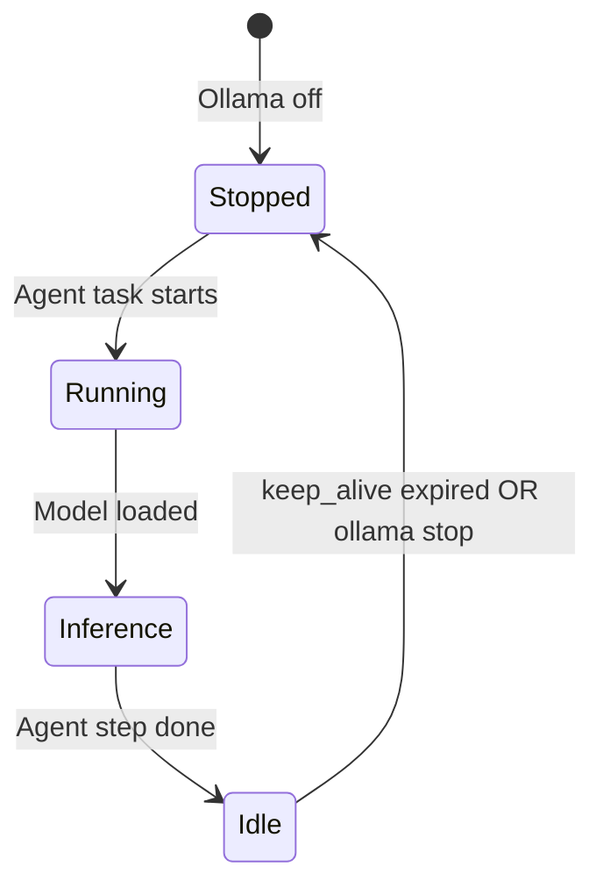

# Local Ollama & Agent Runtime Blueprint

**Status:** Active reference for founder workstation / local agent development  
**Authority:** Supersedes ad-hoc chat notes on local LLM choice; **does not** override production chat (OpenRouter/Gemini on `platform.noetfield.com`).  
**Scope:** Apple Silicon laptop (M5 Pro, 48 GB unified memory) · Ollama · Cursor/agent loops · **not** Noetfield public GTM.

**Related:** [L3-external/README.md](../../L3-external/README.md) (Ollama = local dev only) · [docs/CHATBOT_SETUP.md](../CHATBOT_SETUP.md) (production keys) · `infrastructure/docker/docker-compose.yml` (optional Ollama service).

---

## 1. Design principle

| Rule | Rationale |
|------|-----------|
| **On-demand, not 24/7** | Always-on large models keep GPU/ANE busy → fan noise, heat, battery drain |
| **Smallest model that passes agent tasks** | Agent OS loops amplify token volume; latency and RAM matter more than benchmark max |
| **Production stays cloud** | Public chat, Telegram, and pilots use OpenRouter/Gemini with keys in env — not laptop Ollama |
| **Unload when idle** | `OLLAMA_KEEP_ALIVE` + explicit `ollama stop` when agents finish |

> **One line:** Local Ollama is a **dev inference utility**, not a always-on “Agent OS brain.”

---

## 2. Hardware profile (locked default)

| Item | Value |
|------|--------|
| Machine | MacBook Pro, Apple M5 Pro |
| RAM | 48 GB unified |
| Role | Local Cursor agents, repo work, optional offline inference |
| Not for | 24/7 datacenter substitute, production Noetfield traffic |

---

## 3. Model matrix

### Recommended (daily driver)

| Model | Quant | Role | RAM (~) | Speed (~) | Fan / thermals |
|-------|-------|------|---------|-----------|----------------|
| **Qwen3 14B** | `Q4_K_M` | **Sweet spot** — default local agent model | ~9 GB | ~30–40 tok/s | Low → medium |
| **Phi-4** | (vendor default) | Fast, light, cool — quick edits & classification | Lower than 14B | High | Low |
| **Gemma 3 12B** | `Q4_K_M` | Light, precise — structured tasks | ~8–10 GB | Good | Low |

### Acceptable (heavier sessions, not 24/7)

| Model | Quant | Role | RAM (~) | Speed (~) | Fan / thermals |
|-------|-------|------|---------|-----------|----------------|
| **Qwen3 32B** | `Q4_K_M` | Stronger reasoning when 14B fails a task | ~20 GB | ~15–20 tok/s | Medium |

### Not recommended (local agent / 24/7)

| Model | Why avoid |
|-------|-----------|
| **Qwen3 72B** | Too heavy; fan runs hot continuously |
| **Llama 4 Scout** | Heavy for laptop sustained agent use |
| **Llama 70B+** | RAM and thermals; poor fit for intermittent agent loops |
| **Any model >40B** as **always-loaded** default | Leaves little headroom for IDE, browser, Postgres, Docker stack |

**Note:** Large models can be run **occasionally** for one-off experiments; they are excluded from the **default operating policy**, not from the machine entirely.

---

## 4. Ollama runtime tuning (48 GB, Qwen3 14B default)

Copy into shell profile or `~/.ollama/env` (adjust if using Docker — pass env to `ollama` service):

```bash
# Cap GPU offload — avoid pinning entire model to GPU layers (reduces sustained heat)
OLLAMA_NUM_GPU=20

# One inference at a time — agents should not parallel-blast the daemon
OLLAMA_NUM_PARALLEL=1

# Smaller context — agent turns rarely need 8k+ locally; saves RAM and prefill time
OLLAMA_NUM_CTX=2048

# Unload model weights after idle (5 minutes)
OLLAMA_KEEP_ALIVE=5m
```

| Variable | Default tendency | Blueprint value | Effect |
|----------|------------------|-------------------|--------|
| `OLLAMA_NUM_GPU` | Full offload | `20` | Less aggressive GPU residency → cooler, more CPU/RAM mix |
| `OLLAMA_NUM_PARALLEL` | >1 | `1` | Predictable latency; no queue spikes |
| `OLLAMA_NUM_CTX` | 4096+ | `2048` | Lower KV cache footprint |
| `OLLAMA_KEEP_ALIVE` | long / infinite | `5m` | Auto-unload after idle |

---

## 5. Operating modes

### Mode A — On-demand (recommended)



| Phase | Action |
|-------|--------|
| **Agent starts work** | `ollama serve` (if not running) · `ollama run qwen3:14b` or API pull once |
| **During work** | Cursor/agent calls `localhost:11434` |
| **Agent session ends** | Rely on `OLLAMA_KEEP_ALIVE=5m` **or** `ollama stop` for full shutdown |
| **Overnight** | **No** 24/7 daemon — laptop cool, silent |

### Mode B — Scheduled (optional)

| Time | Action |
|------|--------|
| Morning | `ollama serve` + warm-load **Qwen3 14B Q4_K_M** |
| Workday | On-demand inference per agent |
| Evening | `ollama stop` (hard off) **or** trust `OLLAMA_KEEP_ALIVE=5m` |

### Forbidden policy

- **24/7 loaded Qwen3 32B/72B** on laptop as “Agent OS server”
- Using local Ollama as **production** backend for `www` / `platform` chat (use OpenRouter per [CHATBOT_SETUP.md](../CHATBOT_SETUP.md))

---

## 6. Resource budget (Qwen3 14B Q4_K_M on 48 GB)

| Resource | Usage | Headroom |
|----------|--------|----------|
| Model weights + KV (ctx 2048) | ~9 GB | ~39 GB for macOS, IDE, Docker (Postgres, Redis), browser |
| Qwen3 32B Q4_K_M (when used) | ~20 GB | ~28 GB — acceptable for focused sessions only |

---

## 7. Noetfield repo alignment

| Environment | LLM authority |
|-------------|----------------|
| **Production** `platform.noetfield.com` | `OPENROUTER_API_KEY` / `GEMINI_API_KEY` · `PUBLIC_CHAT_PROVIDER=auto` |
| **Local platform dev** | `.env` may set `AI_PROVIDER=ollama` + `OLLAMA_BASE_URL=http://localhost:11434` |
| **Docker dev stack** | `infrastructure/docker/docker-compose.yml` → `ollama` service on `:11434` |
| **Governance Console MVP** | No LLM required (deterministic v1 engine) |

When testing **public chat behavior**, always validate against cloud provider keys — not laptop Ollama.

---

## 8. Quick reference card (locked defaults)

```
✅ Model:        Qwen3 14B Q4_K_M
✅ Keep alive:   5m
✅ Context:      2048
✅ Parallel:     1
✅ GPU layers:   20 (cap)
✅ 24/7:         NO — on-demand YES
✅ Hardware:     M5 Pro 48GB — comfortable at 14B default
```

---

## 9. Original operator notes (Persian — preserved)

Source notes consolidated into this blueprint:

- ❌ Qwen3 72B — خیلی سنگین، فن دائم  
- ❌ Llama 4 Scout — سنگین  
- ✅ Qwen3 14B — شیرین‌ترین نقطه  
- ✅ Qwen3 32B — قوی‌تر، کمی گرم‌تر (نه 24/7)  
- ✅ Phi-4 — سبک، سریع، خنک  
- ✅ Gemma3 12B — سبک و دقیق  
- مدل‌های بالای 40B برای Agent OS دائمی روی لپ‌تاپ توصیه نمی‌شوند  

---

## 10. Change control

| Change | Requires |
|--------|----------|
| New default local model | Update this file + note RAM/speed in §6 |
| Production LLM switch | Update `CHATBOT_SETUP.md`, `.env.example`, RUNBOOK |
| Enable Ollama in CI/production | **Rejected** unless explicit infra project — conflicts L3 lock |

**Verification (local):**

```bash
ollama ps                    # should be empty after idle + keep_alive
curl -s http://localhost:11434/api/tags
```

---

## Document hierarchy

| Layer | Doc |
|-------|-----|
| Public product | [PRODUCT_TRUTH.md](../../PRODUCT_TRUTH.md) |
| Production chat | [CHATBOT_SETUP.md](../CHATBOT_SETUP.md) |
| **Local agent / Ollama** | **This file** |
| Long-range product vision | [noetfield-future-path.md](./noetfield-future-path.md) |
