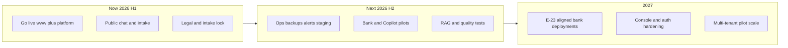

# Noetfield — future path (2026–2027)

**Status:** Active product strategy · **Scope:** Noetfield only  
**Locked boundaries:** [PROJECT_BOUNDARIES_LOCKED.md](../../PROJECT_BOUNDARIES_LOCKED.md)

TrustField Technologies and VIRLUX are **not** part of this document — separate entities ([PROJECT_BOUNDARIES_LOCKED.md](../../PROJECT_BOUNDARIES_LOCKED.md)).

---

## What Noetfield is building toward

**Product:** Governance execution and AI policy enforcement for regulated organizations — pre-execution layer with audit-ready traces ([NORTH_STAR.md](../../NORTH_STAR.md), [PRODUCT_TRUTH.md](../../PRODUCT_TRUTH.md)).

**Not building:** Payment rails, custody, MSB/PSP operations, B2B FX (those are other entities/products).

---

## Market tailwinds (Canada) — Noetfield lens only

| Force | Timing | Noetfield opportunity |
|-------|--------|------------------------|
| **OSFI E-23** (model risk, incl. third-party AI) | Enforceable **May 1, 2027** | Banks procuring **governance + audit evidence** in 2026 — Bank Pilot, Copilot pack, simulation console |
| **Consumer-Driven Banking** Phase 1 (read) | **2026** | Consent/traceability narrative for **policy layer** — partner integrations, not screen-scraping |
| **CDB Phase 2** (write) | **Mid-2027** | Pre-execution controls before payment initiation — **via bank/TPP**, not Noetfield holding funds |
| **Enterprise AI (Copilot)** | Now | Copilot Readiness Pack — policy validation before rollout |

Noetfield does **not** compete on open-banking TPP accreditation or retail wallets.

**Partner-infra GTM (Canada 2026–27):** [canada-partner-gtm-2026.md](./canada-partner-gtm-2026.md) — licensed VASP/exchange adjacency, Trust Ledger brand, Partner Integration Program.

---

## Horizons

### Now — go live and trust surface

Execute go-live P0 ([GO_LIVE.md](../GO_LIVE.md), GitHub Issues labeled `launch`):

- Deploy `www` + `platform` (DNS, TLS, secrets rotation)
- LLM stack (OpenRouter + fallback), `POST /api/intake`, optional Telegram
- Legal pages aligned to three SKUs — no custody/payment claims

**Success:** Production health checks green; first production intakes; public chat stable.

### Next — operational product (2026)

From engineering and www work tracked in **GitHub Issues** (see [ROADMAP.md](../ROADMAP.md)):

| Theme | Examples |
|-------|----------|
| **Reliability** | CI deploy, staging, Postgres backup/retention, Redis sessions |
| **GTM** | Sitemap, gate intake cards, Formspree vs API-only, ecosystem config publish |
| **Governance depth** | RAG/knowledge upgrade, chat quality tests, shadow-run parity docs |
| **Pilots** | Bank Pilot read-only; Copilot policy alignment engagements |

**Success:** Repeatable pilot deployments; `make verify-final-lock` clean on `main`.

### Later — institutional scale (2027)

| Theme | Goal |
|-------|------|
| **E-23 alignment** | Noetfield components documented for bank model inventories (RID, audit export) |
| **Platform** | Auth for pilots, console hardening, observability (Langfuse optional) |
| **Ecosystem** | Documented APIs for partners to attach **pre-execution** checks — no payment execution in Noetfield runtime |

**Success:** At least one FRFI production pilot with immutable audit lineage; no boundary violations in audits.

---

## Competitive focus (Noetfield)

| Play | Stance |
|------|--------|
| AI governance / pre-execution policy | **Core** |
| Bank due diligence & simulation | **Core** (Bank Pilot v6.1) |
| Microsoft Copilot compliance | **Core** (Copilot pack) |
| Payments / FX / wallets | **Out of scope** |
| TrustField corporate / VIRLUX GTM | **Out of scope** (other trackers) |

---

## KPIs (Noetfield product)

| Metric | Target direction |
|--------|------------------|
| Production uptime | Platform + www SLO documented |
| Intake → ops | All vectors to `operations@noetfield.com` |
| Pilot readiness | Bank Pilot + console demo without execution rights |
| Boundary audits | `make verify-final-lock` + zero payment logic in repo positioning |
| Quality | Unit/integration tests for chat, intake, telegram |

---

## Anti-goals

- Mixing TrustField `TF-*` or VIRLUX `VL-*` work into Noetfield sprints
- MSB/PSP registration claims on Noetfield surfaces
- Payment initiation, custody, or FX in platform code
- Screen-scraping “open banking” products

---

## Related (Noetfield only)

| Doc | Use |
|-----|-----|
| [docs/ROADMAP.md](../ROADMAP.md) | Public horizons + shipped summary |
| [ops/README.md](../../ops/README.md) | Issues + private `ops/private/` |
| [PLATFORM_BLUEPRINT.md](../../PLATFORM_BLUEPRINT.md) | Architecture constitution |
| [docs/RUNBOOK.md](../RUNBOOK.md) | Deploy and health |
| [docs/PRACTICAL_PLAYBOOK.md](../PRACTICAL_PLAYBOOK.md) | Roles at go-live |
